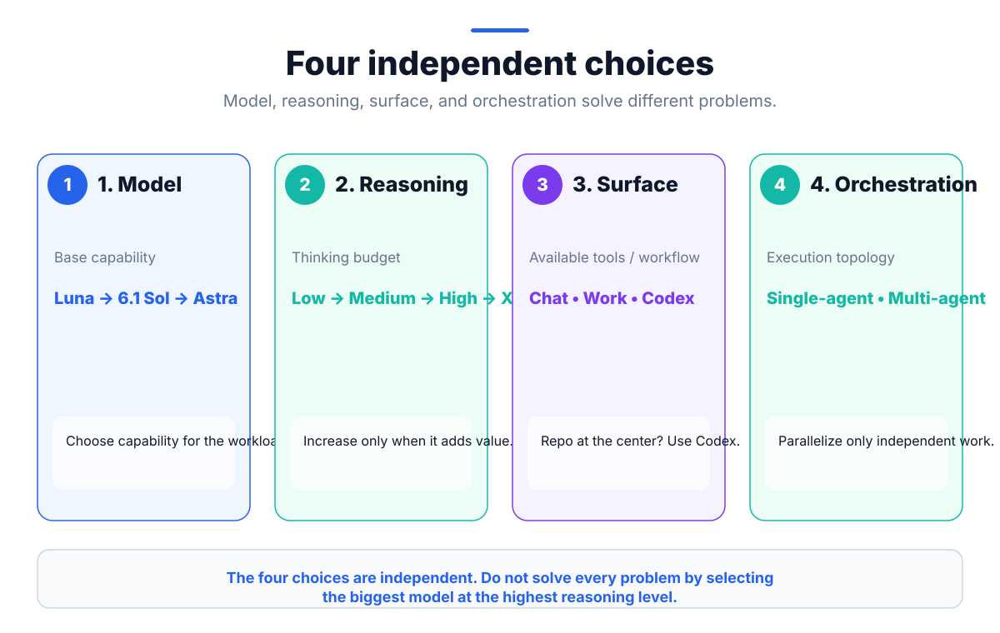
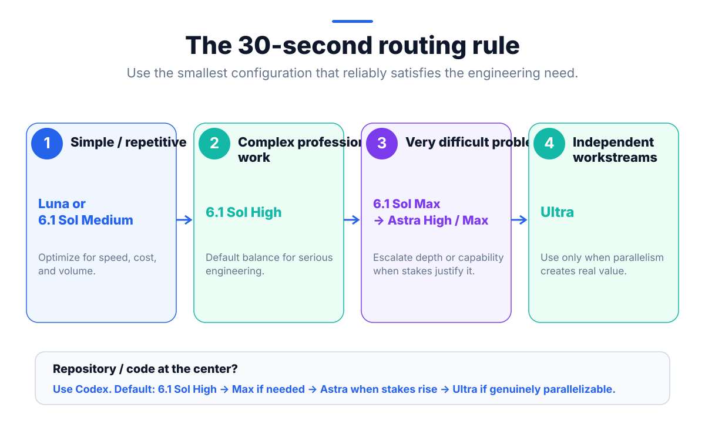
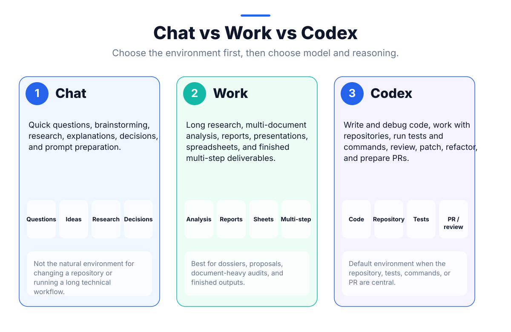
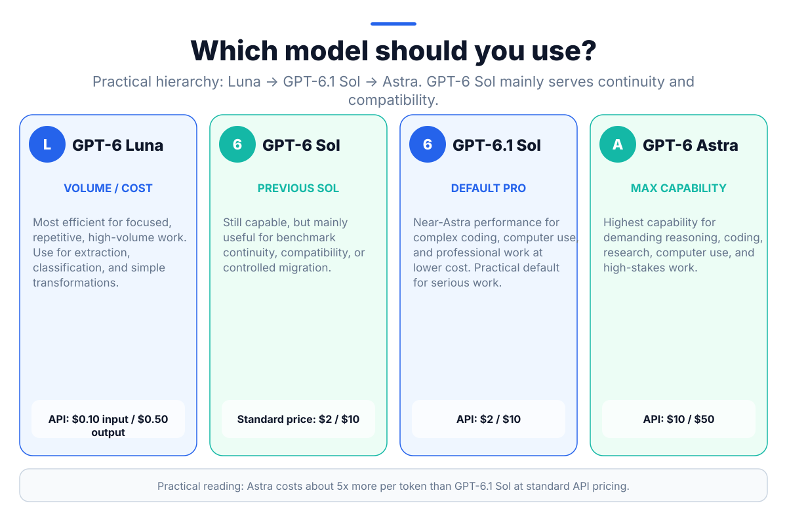
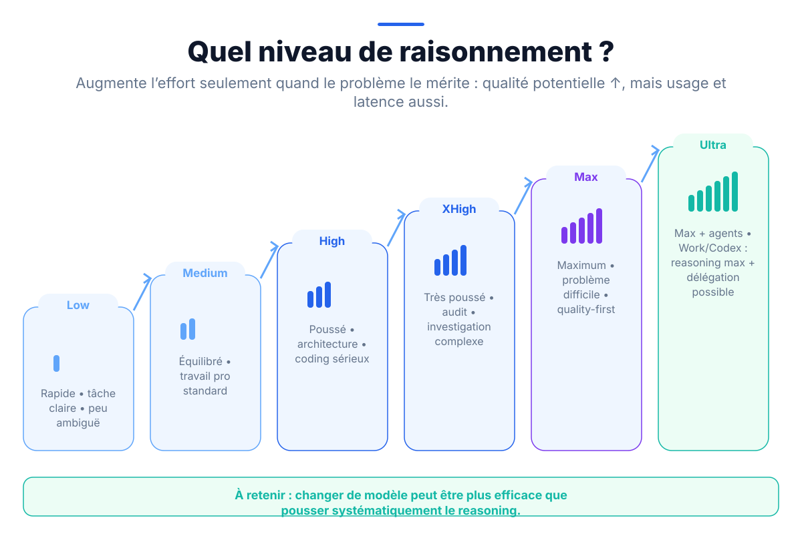
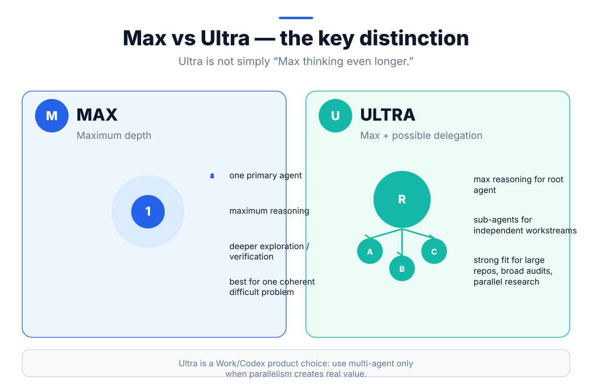
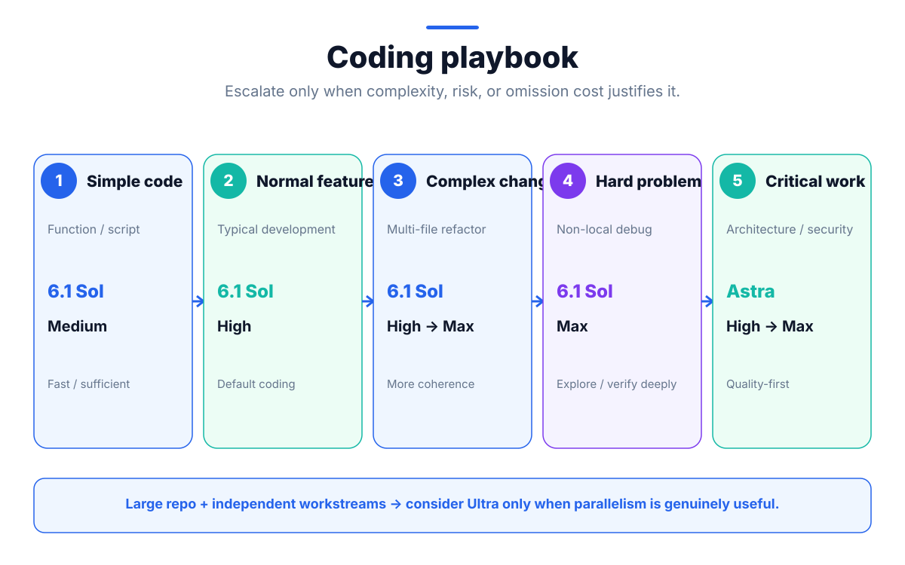
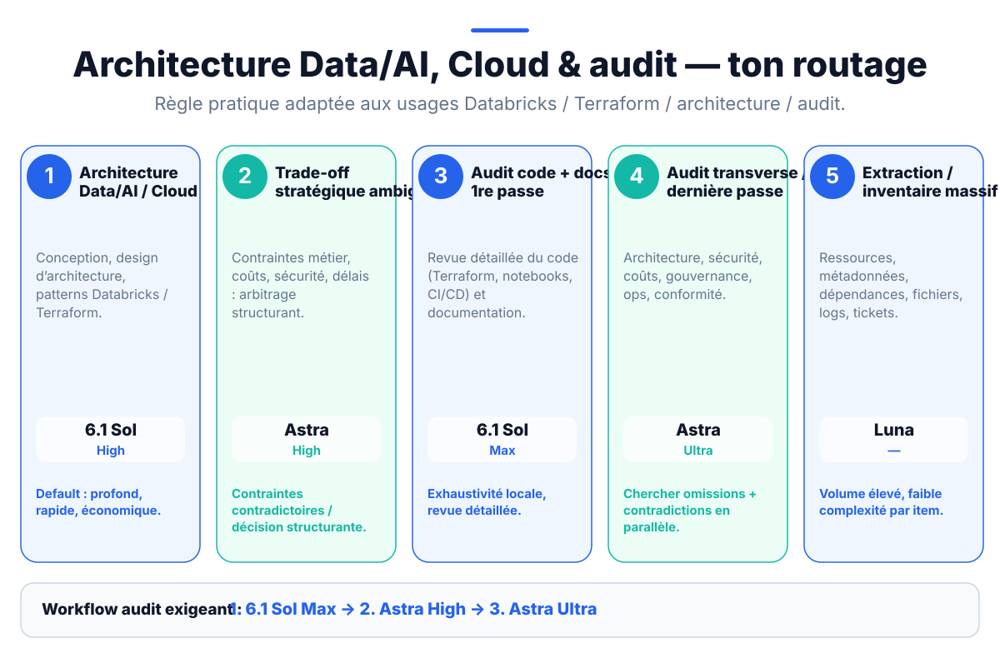
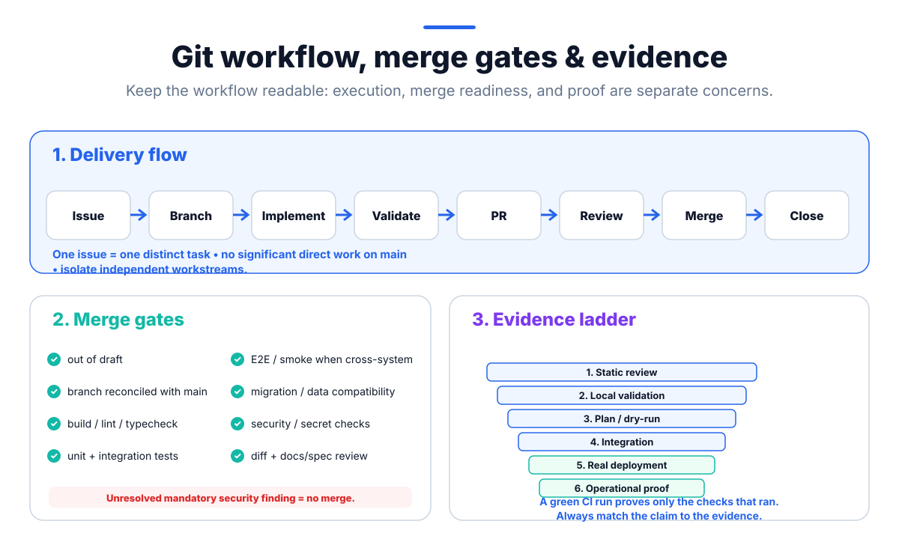

# AI Engineering with Codex — Operating Handbook

> **Purpose:** a practical operating handbook for AI-assisted software, Data/AI, cloud, architecture, and audit work with ChatGPT, Work, and Codex.
>
> This is not a prompt collection and it is not only a long-running-task guide. It defines how to choose the right **surface, model, reasoning level, orchestration pattern, repository context, execution workflow, validation strategy, and review gates**.

The central idea is simple:

> **Use conversations for active work. Use the repository, GitHub issues, specs, ADRs, tests, and Pull Requests as durable engineering memory.**

The handbook combines three layers:

1. **Durable engineering principles** — repository structure, issue-driven execution, planning, review, evidence, security, context management, and recovery.
2. **Operating playbooks** — coding, architecture, Data/AI, cloud, audit, long-running work, and multi-agent execution.
3. **A dated OpenAI routing snapshot** — model names, reasoning options, pricing, Work/Codex behavior, and Ultra guidance verified for October 2026.

---

## 1. The AI Engineering mental model

A good AI-assisted engineering workflow makes four independent decisions:

1. **Model** — how capable the base model is.
2. **Reasoning effort** — how much reasoning budget to allocate.
3. **Surface** — Chat, Work, or Codex.
4. **Orchestration** — single-agent or multi-agent.



Do not collapse these choices into a single idea such as “use the biggest model.”

A harder problem may require:
- the same model with more reasoning;
- a stronger model;
- a different surface with better tools;
- several independent agents;
- or simply better repository context and clearer acceptance criteria.

The correct choice is the **smallest configuration that reliably satisfies the engineering need**.

---

## 2. The 30-second routing rule



Practical default for serious repository work:

```text
GPT-6.1 Sol High
      ↓ if the problem remains difficult
GPT-6.1 Sol Max
      ↓ if stakes, ambiguity, or omission cost are high
GPT-6 Astra High / Max
      ↓ only if independent workstreams truly benefit from parallelism
Ultra
```

For simple, repetitive, high-volume work, start lower: Luna or GPT-6.1 Sol Medium may be more appropriate.

For the most demanding work where quality dominates cost, Astra is the flagship choice.

---

## 3. Choose the surface before the model



| Surface | Best fit | Typical examples |
| --- | --- | --- |
| **Chat** | fast conversational work | questions, brainstorming, quick research, explanations, trade-offs, preparing a plan or prompt |
| **Work** | long, multi-step work and finished deliverables | multi-document research, reports, presentations, spreadsheets, structured analyses, document-heavy audits |
| **Codex** | repository-centered technical work | coding, debugging, refactoring, tests, commands, reviews, patches, Pull Requests |

Rule of thumb:

> **If the repository, code, tests, commands, or PR are central to the task, use Codex.**

Chat is useful for framing and challenge. Work is useful when the main artifact is a finished deliverable. Codex is the default when the real software state matters.

---

## 4. Model selection — October 2026 snapshot

> **Dated snapshot:** model names, availability, pricing, and product options change. Verify current official documentation before turning these facts into permanent automation.



| Model | Positioning | Practical use |
| --- | --- | --- |
| **GPT-6 Luna** | most efficient | focused, repetitive, high-volume work; extraction, classification, simple transformations |
| **GPT-6 Sol** | previous Sol generation | compatibility, historical benchmarks, controlled migration |
| **GPT-6.1 Sol** | near-Astra at lower cost | default professional workhorse for complex coding, computer use, and serious engineering work |
| **GPT-6 Astra** | highest capability | most demanding reasoning, coding, research, computer use, architecture, security, and high-stakes work |

October 2026 standard API pricing from the reference snapshot:

| Model | Input / 1M tokens | Output / 1M tokens |
| --- | ---: | ---: |
| GPT-6 Luna | $0.10 | $0.50 |
| GPT-6.1 Sol | $2 | $10 |
| GPT-6 Astra | $10 | $50 |

Two correct statements can coexist:

- OpenAI positions **Astra** as the flagship model for the hardest reasoning and coding.
- This handbook uses **GPT-6.1 Sol High** as a practical cost-aware default for most serious engineering work, then escalates when the expected quality gain justifies it.

Do not optimize cost prematurely for occasional high-value work. Do optimize model choice when workload volume becomes meaningful.

---

## 5. Reasoning levels



Supported reasoning levels are model-dependent and can include:

```text
none / minimal / low / medium / high / xhigh / max
```

Practical interpretation:

| Level | Use when |
| --- | --- |
| **Low** | the task is clear, bounded, and speed matters |
| **Medium** | standard professional work |
| **High** | architecture, serious coding, multi-step analysis, important decisions |
| **XHigh** | security review, deep audit, difficult investigation, long agentic work |
| **Max** | very difficult work where omission cost is high and quality dominates latency |

Treat reasoning as a **tuning knob**, not the first fix for weak results.

If quality is insufficient, inspect in this order:

1. Is the task actually well specified?
2. Does the model have the right repository/files/context?
3. Is the surface appropriate?
4. Is the model strong enough?
5. Would higher reasoning materially help?
6. Is the task actually several independent tasks that should be separated?

A stronger model at lower effort can outperform a weaker model pushed to its maximum on some workloads. Evaluate on representative tasks.

---

## 6. Max vs Ultra vs Ultrafast



### Max

**Max** is a reasoning-effort setting when supported.

Use it for one coherent, difficult problem:
- non-local debugging;
- complex architecture;
- difficult code review;
- deep verification;
- high omission cost.

### Ultra

In the October 2026 Work/Codex product snapshot, **Ultra** means maximum reasoning with the possibility of additional delegated agents for eligible users.

Use it when the work genuinely contains **independent bounded workstreams**, for example:
- exploring different areas of a large repository;
- parallel security / architecture / testing reviews;
- multi-path research;
- large cross-cutting audits;
- independent implementation or test workstreams.

Ultra is not “Max, but thinking forever.” Its value is primarily **coverage plus parallelism**.

### Ultrafast

**Ultrafast is a separate latency/speed product option.** It should not be confused with Ultra or reasoning depth.

---

## 7. Single-agent vs multi-agent

Use **one agent** when:
- steps depend strongly on one another;
- the task is short;
- several agents would modify the same files or shared mutable state;
- deterministic ordering matters;
- coordination cost is greater than the parallelism benefit.

Use **multiple agents** when:
- sub-problems are independent;
- each workstream is bounded;
- outputs can be merged or reviewed cleanly;
- separate branches/worktrees can isolate changes;
- the main risk is omission or insufficient coverage.

Multi-agent work is a coordination architecture, not a quality magic button.

> Prefer the simplest architecture that can solve the problem reliably.

---

## 8. Coding playbook



| Need | Surface | Model | Reasoning |
| --- | --- | --- | --- |
| simple function / script | Codex | GPT-6.1 Sol | Medium |
| normal feature development | Codex | GPT-6.1 Sol | High |
| complex multi-file refactor | Codex | GPT-6.1 Sol | High → Max |
| difficult / non-local debugging | Codex | GPT-6.1 Sol | Max |
| critical architecture / security | Codex | GPT-6 Astra | High → Max |
| large repo + independent workstreams | Codex | Astra or GPT-6.1 Sol | Ultra when parallelism helps |

Start lower and escalate only when:
- the problem resists;
- ambiguity is high;
- the blast radius is high;
- or the cost of omission is high.

---

## 9. Data/AI, cloud, architecture, and audit playbook



| Need | Practical routing |
| --- | --- |
| Data/AI or cloud architecture | GPT-6.1 Sol High |
| ambiguous strategic trade-off | GPT-6 Astra High |
| first detailed code + documentation audit pass | GPT-6.1 Sol Max |
| cross-cutting final audit / omission search | GPT-6 Astra Ultra when parallelizable |
| large extraction / inventory | GPT-6 Luna |

For a high-stakes audit, a useful pattern is:

1. **Detailed local pass — GPT-6.1 Sol Max**  
   Inspect code, configuration, documentation, contracts, tests, and local inconsistencies.

2. **Architecture/security challenge — Astra High**  
   Challenge structural decisions, contradictions, security assumptions, and cross-layer trade-offs.

3. **Independent cross-cutting pass — Astra Ultra when justified**  
   Search for omissions and contradictions across independent dimensions.

Do not mechanically repeat passes. Each pass must have a distinct purpose.

---

## 10. The repository is durable memory

AI conversations are temporary working context. A serious engineering system must be recoverable from versioned artifacts.

Recommended conceptual structure:

```text
AGENTS.md
README.md

specs/
  modules/
  architecture/
  security/
  data-model/
  decisions/
  prompts/

docs/
src/ or equivalent
tests/
scripts/
```

Responsibilities:

| Artifact | Role |
| --- | --- |
| `AGENTS.md` | canonical persistent agent contract |
| `README.md` | human onboarding and entry point |
| specs | expected behavior and cross-cutting constraints |
| ADRs / decisions | durable architectural choices and rationale |
| GitHub issue | autonomous unit of work: WHY / WHAT / constraints / expected result |
| Pull Request | HOW / actual changes / evidence / limitations |
| tests / CI | executable verification |
| code / migrations | actual implementation |
| GitHub Project | organization, prioritization, readiness, and status |

Do not keep a project-critical decision only in a chat.

---

## 11. `AGENTS.md` as the canonical agent contract

Use the repository `AGENTS.md` for rules that should remain true across tasks:

- repository layout;
- build / test / lint / typecheck commands;
- mandatory conventions;
- architectural constraints;
- security constraints;
- documentation expectations;
- scope / approval boundaries;
- what must be verified before work is complete.

Keep it:
- short;
- normative;
- stable;
- actionable.

Use a local/scoped `AGENTS.md` only when a subtree genuinely needs narrower instructions.

Avoid parallel instruction files that duplicate the same rules and drift apart.

When an agent repeatedly makes the same mistake, turn the correction into:
- an `AGENTS.md` rule;
- a test;
- a lint/static-analysis rule;
- a reusable script;
- or another deterministic guardrail.

---

## 12. Specs, ADRs, and source-of-truth design

Significant behavior should be described independently of implementation details.

Useful durable artifacts include:

### Functional specs
Describe:
- purpose;
- actors;
- business/domain concepts;
- rules;
- state transitions;
- edge cases;
- permissions;
- acceptance criteria.

### Architecture spec
Describe:
- system boundaries;
- component responsibilities;
- important flows;
- external dependencies;
- scalability/resilience/operability goals;
- major technical constraints.

### Security model
Describe:
- authentication and authorization;
- roles and ownership;
- tenant/workspace isolation;
- sensitive data;
- secrets;
- auditability;
- input validation;
- trust boundaries;
- main security risks and controls.

### Data model
Describe:
- entities;
- relations and cardinalities;
- uniqueness;
- lifecycle;
- deletion;
- sensitive fields;
- conceptual constraints.

### ADRs
Use an ADR when a decision is structurally important and worth preserving:
- context;
- decision;
- alternatives;
- consequences;
- date.

Do not create documentation ceremony for trivial local changes. Documentation should reduce future ambiguity, not increase bureaucracy.

### Conceptual model vs implementation

Keep the conceptual/domain model independent from a specific ORM, SQL dialect, document store, or framework.

A useful direction is:

```text
conceptual data model
      ↓
ORM / schema / collections
      ↓
migrations
      ↓
real deployed data structure
```

The implementation should realize the conceptual model; it should not become the only documentation of it.

### Architecture principles

Prefer:
- clear boundaries and responsibilities;
- low coupling;
- explicit dependencies;
- simple designs that fit the current repository;
- abstractions justified by real repetition or change pressure;
- observable and reversible operational behavior.

Do not redesign a repository merely because an agent prefers a different architecture. Adapt to the existing system unless the task explicitly calls for architectural change.

---

## 13. Self-contained GitHub issues

For substantial work, use **one issue per distinct task**.

Before creating a new issue, check whether an equivalent issue already exists and enrich it instead of duplicating it.

A good issue is understandable by another human or LLM **without access to the originating chat**.

Recommended structure:

```markdown
## Objective
## Context / problem
## Expected behavior / outcome
## Scope
## Out of scope
## Acceptance criteria
## Constraints
## Dependencies / Depends on
## Relevant files / specs / references
## Validation / tests
## Definition of Done
```

The issue owns:
- **WHY**
- **WHAT**
- constraints
- expected result

Do not over-specify **HOW** unless a technical or architectural choice is intentionally part of the requirement.

This preserves contributor autonomy while keeping the task reproducible.

---

## 14. Agent Ready, Depends on, and Execution Order

When a GitHub Project uses these fields:

### Agent Ready
`Agent Ready = Yes` means:
- the task is sufficiently specified;
- required context is available;
- constraints and acceptance criteria are clear;
- an agent can begin without reconstructing the requirement from chat history.

### Depends on
Represents a real prerequisite that must be completed first.

### Execution Order
Sequences work that is already ready.

Do not confuse execution order with dependency.

Simple selection rule:

1. consider open issues with `Agent Ready = Yes`;
2. exclude unresolved dependencies;
3. among the remaining work, prefer the lowest `Execution Order`;
4. still apply human priority and risk judgment.

The GitHub Project is a **control/status plane**, not the full execution context. The issue and repository must remain sufficient.

---

## 15. The default engineering loop

A durable AI engineering loop is:

```text
Explore
  ↓
Specify
  ↓
Plan when needed
  ↓
Implement incrementally
  ↓
Verify
  ↓
Review
  ↓
Ship / observe
  ↓
Compound the lesson
```

### Explore
Read the real repository and current state before assuming architecture.

### Specify
Use a compact contract:

```text
Goal
Context
Constraints
Done when
```

Prefer outcome- and rationale-based instructions over prescribing every internal step.

### Plan
Use for complex, risky, cross-layer, ambiguous, or migration-heavy changes.

### Implement
Work in the smallest coherent increments.

### Verify
Use objective checks: tests, build, lint, typecheck, integration, E2E, security, diff review.

### Review
Check correctness, security, spec alignment, and evidence before style.

### Ship / observe
Deploy safely when applicable and validate post-deployment behavior.

### Compound
Turn recurring lessons into durable rules, tests, scripts, docs, or automation.

---

## 16. When to plan — and when not to

A formal plan is useful when:
- architecture changes;
- multiple layers are affected;
- migrations are involved;
- security/trust boundaries change;
- rollback is difficult;
- requirements are ambiguous;
- the blast radius is high.

A plan should identify:
- objective;
- scope;
- affected files/components;
- invariants;
- risks;
- dependencies;
- migration/rollback concerns;
- validation strategy.

For high-risk work, review the plan **before implementation**.

For routine bounded changes, do not impose unnecessary ceremony:

```text
explore → implement → verify
```

is often enough.

---

## 17. Context engineering

More context is not automatically better.

Use the **smallest sufficient context**:
- relevant issue;
- applicable `AGENTS.md`;
- relevant specs / ADRs;
- affected files;
- failing tests or logs;
- current diff;
- linked PR/reviews.

Avoid:
- dumping the entire repository when unnecessary;
- re-sending stale conversation history;
- keeping abandoned hypotheses in the active context;
- one enormous prompt that mixes planning, implementation, review, and deployment.

For complex research/design work, intentional compression is useful:

```text
research notes
   ↓
design / decision document
   ↓
implementation plan
   ↓
issue / PR execution
```

If a session becomes trajectory-poisoned or overloaded with obsolete assumptions, start a fresh context and reconstruct from durable repository state.

### Fresh-thread handoff

A handoff should not depend on a narrative chat summary.

Before leaving a long session, make sure durable artifacts contain:
- current objective and scope;
- decisions and rationale;
- implementation state;
- relevant files/specs;
- completed validation;
- remaining acceptance criteria;
- blockers and dependencies;
- next action.

A fresh thread or agent should begin by reading those artifacts and the current Git state.

---

## 18. Git workflow



Default lifecycle:

```text
Issue
  ↓
Branch / worktree
  ↓
Implementation
  ↓
Tests / validation
  ↓
Pull Request
  ↓
Review
  ↓
Merge
  ↓
Issue closure
```

Rules:
- do not do significant work directly on `main`;
- one branch should have one primary intention;
- unrelated changes belong in separate PRs;
- use separate branches/worktrees for independent parallel work;
- keep `main` integrable and verifiable;
- protect `main` with required PR/status checks when the platform allows it.

---

## 19. What belongs in the Pull Request

The PR links back to the issue and explains the implementation **HOW**:

- what changed;
- implementation approach;
- affected architecture/security/data behavior;
- migrations;
- tests and validation;
- documentation updated;
- evidence collected;
- known limitations;
- follow-up work.

A PR should not be a second vague issue description. It should explain the actual implementation and proof.

Close the issue only after:
- the change is merged;
- acceptance criteria are met;
- Definition of Done is satisfied.

---

## 20. Merge gates

A PR is not merge-ready merely because the code looks plausible.

Depending on the project, require:
- PR out of draft;
- branch sufficiently up to date;
- build / compilation;
- formatting / lint;
- type checking;
- unit tests;
- integration tests;
- E2E / smoke tests for cross-system changes;
- migration / data compatibility checks;
- static analysis;
- secret scanning;
- security checks;
- diff review;
- documentation/spec updates;
- acceptance criteria / DoD.

> **An unresolved security finding or mandatory failing gate blocks merge.**

For cross-layer work, a green unit test is not enough. Validate the integrated path that actually matters.

---

## 21. Stale branches, stacked PRs, and squash merges

Do not infer merge safety from commit topology alone.

A squash merge rewrites history. An old branch can appear “ahead” even when its functional content is already in `main`.

Before merging an old/stacked branch:

1. compare actual content with `main`;
2. inspect already-merged dependency PRs;
3. identify what is truly missing;
4. rebase/update if needed;
5. rerun validation after meaningful changes;
6. close superseded/redundant PRs instead of merging historical noise.

> **Git topology is a signal. The real diff plus validation is the evidence.**

---

## 22. Major dependency and framework migrations

A major framework/provider/runtime/ORM/dependency upgrade deserves explicit handling.

Check:
- breaking changes;
- lockfiles;
- code compatibility;
- infrastructure compatibility;
- migrations;
- changed defaults;
- integration behavior;
- representative tests;
- rollback path.

When multiple pieces must move together, prefer a dedicated coordinated migration PR rather than partial merges that leave `main` temporarily inconsistent.

---

## 23. Review quality

Review in this order:

1. correctness / bugs / regressions;
2. security / isolation / authorization;
3. spec / ADR / invariant alignment;
4. data model / migrations;
5. tests and evidence quality;
6. operability / rollback / observability;
7. maintainability;
8. style last.

Do not maximize comment count. Find what can invalidate the result.

For risky work or final passes, use a **fresh-context independent review** when possible. A reviewer that did not implement the change is more likely to detect:
- hidden assumptions;
- omissions;
- circular rationalization;
- missing edge cases.

Never ship agent-generated code that no responsible human or independent review process has inspected appropriately for the blast radius.

---

## 24. Security and human responsibility

Agents can explore, propose, implement, and review. Responsibility for high-impact decisions remains human.

Require explicit human ownership for:
- production changes;
- destructive actions;
- material security/trust-boundary changes;
- irreversible migrations;
- high-impact architecture changes;
- legal/compliance-sensitive changes;
- decisions where requirements remain ambiguous.

Use least privilege for tools and credentials.

Never place:
- production secrets;
- personal credentials;
- sensitive production data

in prompts, issues, logs, examples, or repository fixtures unless the project has an explicit approved handling mechanism.

Use synthetic or sanitized data for tests and evidence.

### Demo, test, and production data

Do not quietly mix demo/test data with real production data.

For examples, fixtures, screenshots, logs, and public evidence:
- prefer synthetic data;
- sanitize identifiers and secrets;
- avoid real customer/personal data;
- make simulated/demo status explicit;
- never present synthetic evidence as production proof.

---

## 25. Evidence levels

Do not confuse “a check passed” with “the system works in production.”

Evidence ladder:

1. **Static review** — code/configuration/document review.
2. **Local validation** — lint, build, types, unit tests.
3. **Plan / dry-run** — predicted execution without applying it.
4. **Integration** — components validated together.
5. **Real deployment** — applied to a target environment.
6. **Operational proof** — observed behavior through metrics, logs, health checks, output data, or real-user/system signals.

Claims must match the evidence level actually obtained.

### Release and deployment discipline

For significant releases, keep deployment evidence proportional to risk:
- release notes or PR summary;
- version/tag from reviewed `main`;
- deployment order when multiple components are involved;
- rollback strategy or restore point;
- post-deployment checks;
- sanitized logs/metrics/output where useful;
- clear distinction between functional proof and performance/benchmark proof.

For infrastructure or platform changes, prefer ordered, reproducible deployment steps rather than undocumented manual actions.

Examples:
- `terraform validate` does not prove `terraform apply` succeeds.
- a mock test does not prove an external integration works.
- a green CI run does not prove deployment succeeded.
- a successful deployment does not prove business behavior is correct.

---

## 26. Long-running work and recovery

Long-running work is one use case of this handbook, not its identity.

The previous default based on `TASK_STATE.md` is **deprecated**.

Use:
- self-contained issue;
- linked PR and reviews;
- branch state;
- `git status`;
- `git diff`;
- relevant repository files/specs/tests;
- Git history.

Recovery procedure:

1. read the issue;
2. inspect linked PR/review discussion;
3. inspect current branch/diff/status;
4. identify completed work;
5. identify remaining acceptance criteria;
6. do **not** redo completed work;
7. update the issue if durable context is missing;
8. continue from the real repository state.

Use a task-state file only when a specific repository workflow explicitly requires it.

---

## 27. Deterministic workflows vs agents

Prefer a deterministic workflow when deterministic automation is sufficient.

Good candidates:
- formatting;
- linting;
- code generation with strict templates;
- schema checks;
- CI gates;
- repeatable transformations;
- policy enforcement.

Use an agent when the work requires:
- interpretation;
- planning;
- exploration;
- multi-step tool use;
- trade-offs;
- ambiguity resolution;
- adaptive debugging.

Agentic loops need scaffolding:
- explicit goal;
- success criteria;
- bounded scope;
- tool permissions;
- observation;
- tests;
- stop conditions;
- iteration ceilings where appropriate;
- human escalation when uncertainty remains.

Errors compound in long autonomous loops. More autonomy should come with stronger verification.

---

## 28. Prompting principles

A strong engineering instruction usually needs:

```text
Goal
Context
Constraints
Done when
```

Good prompts:
- describe the outcome;
- explain important rationale;
- identify invariants and hard constraints;
- state objective acceptance criteria;
- reference the real repository artifacts;
- allow the contributor to choose implementation details unless constrained.

Avoid:
- prescribing every hidden reasoning step;
- embedding stale architecture assumptions;
- asking for broad unrelated refactors;
- combining several independent tasks into one huge request;
- relying on chat memory for critical context.

For recurring workflows, version reusable prompts in the repository.

---

## 29. Long-lived product cadence

For a long-lived product, compound improvements continuously rather than accumulating a large “AI cleanup” phase.

A useful cadence is:

```text
issue / feature
   ↓
implementation + verification
   ↓
review + merge
   ↓
update specs / ADR / AGENTS / prompts only when the lesson is durable
   ↓
next bounded task
```

After each meaningful change:
- keep specs aligned with behavior;
- preserve architectural decisions that matter;
- add tests for regressions that should never return;
- convert recurring mistakes into deterministic guardrails;
- remove obsolete instructions;
- keep the repository easy for a fresh human or agent to understand.

---

## 30. Definition of Done

A significant engineering task is complete only when the relevant subset is true:

- requested behavior is implemented;
- specs and implementation are consistent;
- architecture/security/data constraints remain valid;
- build succeeds;
- lint/type checking succeeds;
- relevant unit/integration/E2E tests pass;
- migrations are validated;
- security implications are reviewed;
- UI changes are visually validated where applicable;
- diff has been reviewed;
- no unrelated changes are mixed in;
- documentation is updated;
- PR evidence matches the claims;
- rollback/operability considerations are addressed where relevant;
- issue acceptance criteria and DoD are satisfied.

Project-specific commands belong in that project’s `AGENTS.md`.

---

## 31. Anti-patterns

Avoid:

- treating conversation memory as project memory;
- working directly on `main` for significant changes;
- one giant issue that mixes unrelated work;
- issues that depend on undocumented chat history;
- duplicate issues instead of enriching an existing equivalent issue;
- over-specifying HOW without a real constraint;
- merging draft PRs;
- merging with mandatory red checks;
- ignoring unresolved security findings;
- assuming `ahead_by` means “must merge”;
- trusting unit tests as end-to-end proof;
- claiming deployment from static validation;
- multi-agent execution on shared mutable files without coordination;
- using the strongest model and maximum reasoning for every task;
- using a weaker model at Max when a better model is the real need;
- long autonomous loops without stop conditions and verification;
- unread AI-generated code entering production;
- duplicating canonical instructions across conflicting files;
- storing secrets or sensitive production data in prompts/repo fixtures;
- unrelated opportunistic refactors inside a scoped task;
- documentation that is heavier than the system it is supposed to clarify.

---

## 32. Reusable evaluation mindset

For a recurring AI workflow, do not choose models by intuition alone.

Maintain representative cases and compare:
- correctness;
- omissions;
- test pass rate;
- review findings;
- latency;
- token/credit cost;
- human intervention required.

Then choose the lightest configuration that consistently clears the quality bar.

Re-evaluate when:
- models change;
- workload changes;
- repository scale changes;
- the cost of failure changes.

---

## 33. Sources and October 2026 OpenAI snapshot

The durable engineering practices in this handbook are repository/workflow principles. The following model/product facts are a **dated October 2026 snapshot** and should be rechecked before automation or procurement decisions.

Official OpenAI references:

- Models: https://developers.openai.com/api/docs/models
- GPT-6.1 Sol: https://developers.openai.com/api/docs/models/gpt-6.1-sol
- GPT-6 Astra: https://developers.openai.com/api/docs/models/gpt-6-astra
- GPT-6 Sol: https://developers.openai.com/api/docs/models/gpt-6-sol
- Reasoning models: https://developers.openai.com/api/docs/guides/reasoning
- Multi-agent: https://developers.openai.com/api/docs/guides/responses-multi-agent
- ChatGPT Work & Codex: https://help.openai.com/en/articles/20001275-chatgpt-work-and-codex
- Rate card / plan-specific product options: https://help.openai.com/en/articles/11481834-chatgpt-rate-card-business-enterpriseedu-credit-based-pricing

Availability of models, Ultra, Ultrafast, and workspace options depends on plan, workspace settings, and rollout.

---

## 34. Final principle

The goal of AI Engineering with Codex is not to make an agent remember everything.

The goal is to build an engineering system where:

- intent is explicit;
- durable context is versioned;
- the right model and surface are chosen intentionally;
- work units are autonomous and recoverable;
- architecture and security decisions are preserved;
- implementation is incremental;
- verification is executable;
- reviews are evidence-driven;
- autonomy is proportional to guardrails;
- and a fresh human or agent can continue from the repository without needing the previous conversation.

That is what makes AI-assisted engineering scalable.
