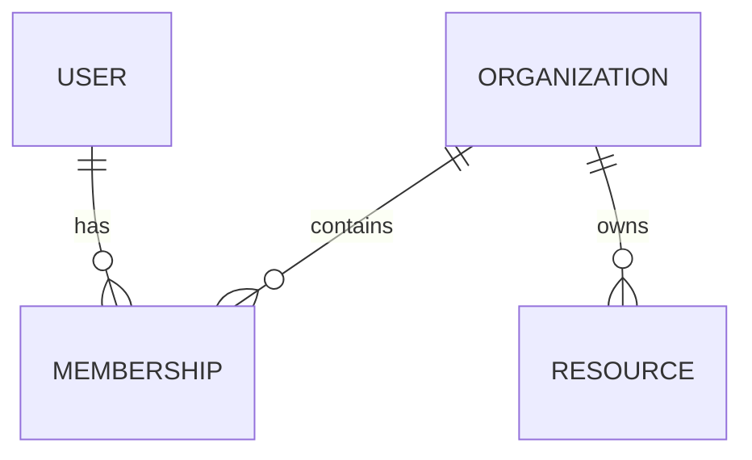

# Guide de développement d’un logiciel complet avec Codex

> **Statut : guide de référence optionnel.**  
> Ce fichier n’a pas vocation à être relu intégralement à chaque tâche. `AGENTS.md` reste la couche d’instructions permanente du projet. Pour une tâche donnée, Codex doit surtout inspecter les specs, le code, les tests et l’état Git directement concernés.

Ce guide décrit une méthode générique pour construire, maintenir et faire évoluer un logiciel complexe avec Codex.

Il est volontairement **agnostique** vis-à-vis :

- du langage ;
- du framework frontend ou backend ;
- du type d’application ;
- de la base de données ;
- de l’ORM ;
- du cloud ;
- du système de CI/CD ;
- de l’outil de déploiement.

Les chemins, exemples et commandes présentés ici doivent donc être adaptés au repository réel.

> **Principe central :** la conversation sert à travailler ; le repository sert à mémoriser, transmettre, vérifier et reprendre le travail.

---

## 1. Principes directeurs

### 1.1 Le repository est la source de vérité

Pour un logiciel important, la connaissance durable ne doit pas vivre uniquement dans une conversation avec Codex. Elle doit être versionnée dans le repository.

Structure conceptuelle recommandée :

```text
AGENTS.md
README.md

specs/
  modules/
  architecture/
  security/
  data-model/
  decisions/
  prompts/

docs/

src/ ou équivalent
tests/
scripts/
```

Responsabilités :

| Élément | Rôle |
| --- | --- |
| `AGENTS.md` | Règles permanentes de travail pour les agents |
| `README.md` | Onboarding, installation et utilisation |
| `specs/modules/` | Comportement fonctionnel |
| `specs/architecture/` | Architecture structurante |
| `specs/security/` | Modèle et exigences de sécurité |
| `specs/data-model/` | Modèle de données indépendant de l’implémentation |
| `specs/decisions/` | Décisions d’architecture durables |
| `specs/prompts/` | Prompts réutilisables |
| `docs/` | Exploitation, procédures et documentation technique complémentaire |
| Code + migrations + tests | Implémentation réelle |

Les noms exacts peuvent être adaptés au projet.

### 1.2 Codex travaille mieux sur des tâches bornées

Éviter les demandes trop larges :

```text
Termine tout le module de facturation.
```

Préférer une demande structurée contenant :

1. l’objectif ;
2. le contexte ;
3. les contraintes ;
4. la Definition of Done.

Exemple :

```text
Lis AGENTS.md, les specs concernées et le code existant.

Objectif :
Ajouter la possibilité d’associer plusieurs devises à un compte.

Contraintes :
- conserver les invariants métier existants ;
- ne pas hard-coder les données métier ;
- respecter l’architecture existante ;
- éviter les refactors hors scope ;
- mettre à jour les specs concernées.

Done when :
- le modèle de données représente correctement le besoin ;
- les règles métier sont implémentées ;
- les interfaces concernées sont adaptées ;
- les tests pertinents passent ;
- les validations projet passent.
```

### 1.3 Les specs accompagnent le logiciel

Une fonctionnalité significative doit être décrite indépendamment de son implémentation.

Une bonne spec répond notamment à :

- pourquoi la fonctionnalité existe ;
- qui l’utilise ;
- quelles entités sont impliquées ;
- quelles règles métier s’appliquent ;
- quelles données doivent être persistées ;
- quels calculs ou états sont attendus ;
- quelles contraintes UX existent ;
- quels cas d’erreur doivent être gérés ;
- quels critères d’acceptation prouvent que le besoin est couvert.

Pour une correction locale déjà parfaitement spécifiée, une phase documentaire préalable n’est pas obligatoire.

### 1.4 La vérification fait partie de l’implémentation

Une tâche n’est pas terminée lorsque le code est simplement écrit.

Selon le projet, Codex doit exécuter ou vérifier :

- tests unitaires ;
- tests d’intégration ;
- tests end-to-end si pertinents ;
- compilation ou build ;
- lint ;
- validation des types ;
- migrations ;
- analyse statique ;
- contrôle du diff ;
- validation visuelle des changements UI ;
- vérifications de sécurité ;
- `git diff --check` ou équivalent.

Les commandes exactes doivent être définies dans `AGENTS.md`.

---

## 2. Les surfaces de configuration et de connaissance

### 2.1 `AGENTS.md`

`AGENTS.md` est la couche de règles durables du repository.

Il doit être :

- court ;
- normatif ;
- actionnable ;
- stable.

Y mettre notamment :

- commandes de build, lint et test ;
- conventions obligatoires ;
- architecture générale du repository ;
- règles de sécurité ;
- règles de documentation ;
- restrictions importantes ;
- comportement attendu avant de terminer une tâche.

Ne pas y mettre :

- specs métier détaillées ;
- longues explications d’architecture ;
- secrets ;
- journal de projet ;
- contexte temporaire d’une feature.

> Si Codex répète régulièrement la même erreur, transformer la correction en règle durable dans `AGENTS.md` ou dans un `AGENTS.md` local au sous-répertoire concerné.

### 2.2 `specs/modules/`

Les specs fonctionnelles vivent dans `specs/modules/`.

```text
specs/
  modules/
    authentication.md
    users.md
    billing.md
    reporting.md
    imports.md
    notifications.md
```

Structure possible :

```markdown
# Module

## Objectif
## Acteurs
## Concepts métier
## Règles métier
## Données manipulées
## Parcours principaux
## Cas limites
## Permissions
## Critères d’acceptation
```

Ces fichiers décrivent **ce que fait le logiciel**, pas la manière dont un framework particulier l’implémente.

---

## 3. Les trois specs transverses minimales

En plus des specs fonctionnelles, un logiciel significatif devrait disposer de trois descriptions transverses : architecture, sécurité et modèle de données.

L’objectif n’est pas de produire une documentation lourde. Quelques pages bien maintenues valent mieux qu’une architecture de 100 pages jamais relue.

### 3.1 Spec d’architecture structurante

Fichier recommandé :

```text
specs/architecture/system-architecture.md
```

Cette spec décrit uniquement les choix structurants qui influencent plusieurs modules.

Elle peut contenir :

- objectifs architecturaux : maintenabilité, simplicité, scalabilité, résilience, portabilité, observabilité ;
- vue globale des composants ;
- responsabilités des couches ;
- frontières importantes ;
- flux structurants ;
- dépendances externes critiques ;
- contraintes techniques majeures ;
- références vers les ADR concernées.

Exemple conceptuel :

```text
Client
  ↓
API / application
  ↓
services métier
  ↓
persistence
  ↓
systèmes externes
```

Éviter d’en faire un catalogue de classes, de fichiers ou de composants techniques.

### 3.2 Spec de sécurité

Fichier recommandé :

```text
specs/security/security-model.md
```

Elle décrit le **modèle de sécurité du produit**, indépendamment d’un fournisseur d’identité ou d’un framework particulier.

Elle peut couvrir :

- types d’utilisateurs ;
- authentification ;
- gestion des sessions ;
- MFA si nécessaire ;
- récupération de compte ;
- rôles et permissions ;
- ownership ;
- séparation par organisation / tenant / workspace ;
- données sensibles ;
- contrôles serveur ;
- validation des entrées ;
- protection contre les accès horizontaux ;
- principe du moindre privilège ;
- auditabilité ;
- gestion des secrets ;
- risques principaux ;
- critères de validation sécurité.

Une feature qui modifie le modèle de confiance, les rôles ou l’isolation doit mettre à jour cette spec et, si nécessaire, produire une ADR.

### 3.3 Spec du modèle de données

Fichier recommandé :

```text
specs/data-model/domain-model.md
```

Cette spec est volontairement **indépendante de Prisma, Hibernate, Entity Framework, SQLAlchemy, Django ORM ou de tout autre outil**.

Pour chaque entité importante, documenter au minimum :

- responsabilité ;
- attributs métier principaux ;
- relations ;
- cardinalités ;
- contraintes ;
- règles d’unicité ;
- cycle de vie ;
- règles de suppression ;
- données sensibles éventuelles.

La spec peut contenir un diagramme Mermaid :



Éviter de figer inutilement :

- type SQL précis ;
- nom d’index spécifique ;
- syntaxe ORM ;
- annotation framework ;
- stratégie physique détaillée.

Relation recommandée :

```text
specs/data-model/domain-model.md
        ↓
modèle ORM / schéma SQL / documents / collections
        ↓
migrations
        ↓
base réelle
```

Le modèle ORM doit **implémenter** la spec de données, pas devenir l’unique documentation conceptuelle.

---

## 4. ADR : décisions structurantes

Les décisions qui ont un impact durable doivent être conservées dans :

```text
specs/decisions/
```

Exemple :

```text
001-use-relational-database.md
002-separate-domain-services.md
003-multi-tenant-isolation.md
```

Format simple :

```markdown
# ADR-003 — Isolation multi-tenant

## Contexte
## Décision
## Alternatives considérées
## Conséquences
## Date
```

Créer une ADR uniquement lorsqu’une décision mérite réellement d’être conservée. Ne pas transformer chaque choix de code en ADR.

---

## 5. README

Le `README.md` s’adresse principalement à un humain qui découvre ou exécute le projet.

Il doit généralement contenir :

- objectif du projet ;
- prérequis ;
- installation ;
- configuration ;
- démarrage ;
- tests ;
- structure générale ;
- variables d’environnement ;
- liens vers les specs.

Éviter d’y déplacer toute la documentation métier ou architecture.

---

## 6. Relation entre les fichiers

### 6.1 Changement fonctionnel

```text
spec module
    ↓
modèle de données si nécessaire
    ↓
implémentation
    ↓
tests
    ↓
README si impact utilisateur
```

Créer ou modifier une ADR uniquement si une décision structurante apparaît.

### 6.2 Changement de données

Lorsqu’une donnée persistante change :

1. mettre à jour la spec fonctionnelle si nécessaire ;
2. mettre à jour `specs/data-model/domain-model.md` si le modèle conceptuel change ;
3. modifier le modèle ORM ou le schéma physique ;
4. créer la migration si nécessaire ;
5. adapter les services métier ;
6. adapter les imports / exports ;
7. vérifier les tests et migrations.

### 6.3 Changement d’architecture

Lorsqu’une décision touche plusieurs modules :

1. mettre à jour la spec d’architecture ;
2. créer une ADR si la décision mérite d’être conservée ;
3. identifier les modules impactés ;
4. implémenter par incréments ;
5. vérifier l’absence de dérive architecture / code.

### 6.4 Changement de sécurité

Lorsqu’une évolution touche l’authentification, l’autorisation, les rôles, les données sensibles, l’isolation, les imports / exports, l’audit ou les secrets :

1. mettre à jour la spec sécurité ;
2. mettre à jour la spec fonctionnelle concernée ;
3. créer une ADR si le modèle de confiance change ;
4. ajouter ou adapter les tests sécurité ;
5. revoir les logs, erreurs et données temporaires.

---

## 7. Workflow Git recommandé

Principe :

> **Une branche = une intention principale.**

Cycle typique :

```text
main
  ↓
feature/...
  ↓
spec
  ↓
implementation
  ↓
tests
  ↓
review
  ↓
commit
  ↓
PR
  ↓
merge
```

Étapes :

1. créer une branche courte ;
2. lire les instructions et specs concernées ;
3. clarifier le besoin ;
4. mettre à jour les specs nécessaires ;
5. implémenter la tranche minimale ;
6. exécuter les validations ;
7. revoir le diff ;
8. corriger ;
9. commit ;
10. PR ou merge selon le workflow de l’équipe.

---

## 8. Revue du diff

Prompt générique :

```text
Review les changements non committés comme une Pull Request.

Priorise :
- bugs ;
- régressions ;
- incohérences specs / code ;
- problèmes de modèle de données ;
- risques sécurité ;
- tests manquants ;
- changements hors scope.

Ne propose pas de refactor cosmétique non demandé.
```

---

## 9. Travailler sur les tâches longues

Le contexte conversationnel est temporaire. Pour une tâche longue ou interrompable, maintenir :

```text
TASK_STATE.md
```

Structure recommandée :

```markdown
# Task State

## Objectif
## Terminé
## En cours
## À faire
## Décisions prises
## Fichiers importants
## Validations effectuées
## Risques / blocages
## Prochaine étape
```

Codex doit mettre ce fichier à jour régulièrement. Il peut être supprimé à la fin si sa conservation n’a plus de valeur.

---

## 10. Reprendre après une interruption

Prompt recommandé :

```text
Continue.

Avant de poursuivre, reconstruis précisément l’état du travail à partir de :

1. TASK_STATE.md
2. git status
3. git diff
4. les fichiers du repository
5. l’historique encore disponible

Identifie ce qui est déjà terminé et ce qui reste à faire.
Ne refais pas les tâches terminées.

Puis continue la tâche initiale jusqu’à son terme.
```

La reprise doit s’appuyer en priorité sur l’état réel du repository.

---

## 11. Changer de thread sans perdre le contexte utile

Garder le même thread lorsque :

- la tâche reste identique ;
- le contexte récent est encore utile ;
- Codex doit corriger sa propre implémentation ;
- le nombre de fichiers reste raisonnable.

Créer un nouveau thread lorsque :

- on change de feature ;
- le contexte contient trop d’explorations abandonnées ;
- des contraintes anciennes polluent la tâche ;
- une revue indépendante est souhaitée ;
- la feature précédente est terminée.

Dans un nouveau thread, relire au minimum `AGENTS.md`, les specs concernées, `TASK_STATE.md` s’il existe et le diff courant si nécessaire.

---

## 12. Handoff

Avant de quitter une longue session, produire un handoff court contenant :

- objectif ;
- état actuel ;
- décisions prises ;
- fichiers modifiés ;
- validations réalisées ;
- validations restantes ;
- risques connus ;
- prochaine étape.

Ce handoff peut être conservé dans `TASK_STATE.md`, une issue, une PR, une note temporaire ou le prochain prompt.

---

## 13. Prompts réutilisables

### 13.1 Cadrer une feature

```text
Lis AGENTS.md, README.md et les specs existantes.

Je veux ajouter :
[description]

Avant l’implémentation :
- identifie les specs concernées ;
- clarifie les règles métier ;
- identifie les impacts architecture, données et sécurité ;
- propose les critères d’acceptation ;
- liste les fichiers probablement concernés.

Ne crée pas de complexité inutile.
```

### 13.2 Implémenter depuis une spec

```text
Lis AGENTS.md et les specs concernées.

Implémente uniquement ce qui est décrit.

Contraintes :
- respecter l’architecture existante ;
- ne pas hard-coder les données métier ;
- ne pas introduire de dépendance inutile ;
- ne pas refactorer hors scope ;
- préserver les comportements existants non concernés.

Mets à jour les specs et README si nécessaire.
Termine par les validations définies dans AGENTS.md.
```

### 13.3 Debugger

```text
Bug :
[description]

Reproduction :
[étapes]

Attendu :
[...]

Observé :
[...]

Identifie la cause racine avant de modifier le code.
Implémente ensuite le correctif minimal.
Si le bug révèle une ambiguïté de spec, mets la documentation correspondante à jour.
Exécute les validations pertinentes.
```

### 13.4 Refactoriser

```text
Je veux refactoriser [zone] pour [objectif].

Contraintes :
- comportement fonctionnel inchangé ;
- modèle de données inchangé sauf demande explicite ;
- pas de changement UX ;
- changements faciles à reviewer ;
- validations avant et après.

Commence par cartographier les dépendances et les risques.
```

### 13.5 Revue architecture

```text
Review l’architecture de cette implémentation.

Compare-la avec :
- specs/architecture/ ;
- specs/data-model/ ;
- les ADR pertinentes.

Vérifie notamment :
- séparation des responsabilités ;
- dépendances incorrectes ;
- duplication de logique métier ;
- couplage excessif ;
- dépendances circulaires ;
- cohérence avec le modèle de données ;
- maintenabilité.

Priorise les risques réels.
```

### 13.6 Revue sécurité

```text
Fais une revue sécurité de cette feature.

Compare avec specs/security/.

Cherche en priorité :
- contrôle d’accès manquant ;
- validation uniquement côté client ;
- accès horizontal possible ;
- exposition de données sensibles ;
- secrets ;
- logs trop bavards ;
- erreurs révélant des informations internes ;
- imports non validés ;
- exports trop permissifs ;
- incohérences entre spec et implémentation.

Classe les findings par sévérité.
```

### 13.7 Revue du modèle de données

```text
Review le changement de modèle de données.

Compare :
- la spec fonctionnelle ;
- specs/data-model/domain-model.md ;
- le modèle ORM ou schéma physique ;
- les migrations.

Vérifie :
- cardinalités ;
- contraintes ;
- unicité ;
- nullable / obligatoire ;
- ownership ;
- cycle de vie ;
- suppression ;
- compatibilité avec les données existantes.

Ne propose pas d’optimisation physique sans besoin démontré.
```

---

## 14. Plan avant tâche complexe

Pour une migration, une refonte importante ou un changement à risque, demander un plan avant l’implémentation.

Le plan doit préciser :

- le besoin ;
- les specs impactées ;
- les impacts architecture, sécurité et données ;
- les fichiers probablement concernés ;
- 5 à 8 étapes d’exécution ;
- les principaux risques ;
- les validations finales.

Pour une correction locale simple, un plan formel est inutile.

---

## 15. Développement incrémental

Éviter de modifier simultanément de grandes parties indépendantes du système.

Préférer :

```text
spec
  ↓
modèle
  ↓
backend / domaine
  ↓
interface
  ↓
tests
  ↓
review
```

Chaque incrément doit être suffisamment petit pour être compris et revu.

---

## 16. Sécurité des secrets

Ne jamais versionner :

- clés API ;
- mots de passe ;
- tokens ;
- certificats privés ;
- credentials cloud ;
- données personnelles réelles inutiles ;
- exports clients sensibles.

Utiliser selon l’environnement :

- variables d’environnement ;
- secret manager ;
- vault ;
- credentials temporaires.

Le repository peut contenir les **noms** des variables requises, mais pas leurs valeurs réelles.

---

## 17. Données de démonstration et données réelles

Séparer clairement :

```text
données de démonstration
≠ données de développement
≠ données de test
≠ données de production
```

Éviter que :

- les seeds deviennent une source de vérité métier ;
- les tests dépendent de données réelles ;
- des exports de production soient committés ;
- les exemples contiennent des données personnelles.

---

## 18. Architecture : principes génériques

Chercher à conserver des frontières claires entre :

```text
présentation
application / orchestration
domaine métier
persistence
intégrations externes
infrastructure
```

Ce découpage n’implique pas nécessairement six dossiers différents. Le principe important est que les responsabilités restent compréhensibles et testables.

Exemple de flux :

```text
UI / API
   ↓
use case / application service
   ↓
domain logic
   ↓
repository / persistence
```

Pour une architecture simple, plusieurs couches peuvent être fusionnées. Ne pas introduire de complexité architecturale sans justification.

---

## 19. Modèle de données : conceptuel vs implémentation

Le modèle conceptuel décrit le métier. L’ORM ou le schéma physique décrit son implémentation.

```text
specs/data-model/domain-model.md
        ↓
Prisma / Hibernate / Entity Framework
SQLAlchemy / Django ORM / Drizzle / TypeORM
SQL natif / MongoDB schema / autre
```

La spec ne doit pas contenir d’hypothèse inutile propre à l’outil choisi. Lorsqu’un ORM change, le modèle métier doit rester compréhensible.

---

## 20. Déploiement

Le déploiement doit être traité comme une opération contrôlée.

Avant une mise en production, vérifier au minimum :

- environnement cible ;
- configuration ;
- secrets ;
- migrations ;
- compatibilité des données ;
- stratégie de rollback ;
- build ;
- tests ;
- observabilité ;
- health checks ;
- sauvegarde si nécessaire ;
- changements de sécurité ;
- changements d’infrastructure ;
- impacts utilisateurs.

Ne lancer aucune action destructive sans validation explicite.

---

## 21. Definition of Done standard

Pour une feature significative, le travail est terminé lorsque :

- la spec fonctionnelle est à jour ;
- la spec architecture est à jour si un choix structurant change ;
- la spec sécurité est à jour si le modèle de sécurité change ;
- la spec data-model est à jour si le modèle conceptuel change ;
- les ADR nécessaires existent ;
- l’implémentation correspond aux specs ;
- aucun comportement non demandé n’a été ajouté ;
- les tests pertinents passent ;
- le build passe ;
- le lint passe ;
- les migrations sont validées si elles changent ;
- les parcours UI importants sont vérifiés si nécessaire ;
- le diff a été relu ;
- aucun secret ou fichier indésirable n’est introduit ;
- les risques ou validations non effectuées sont explicitement signalés.

---

## 22. Anti-patterns

Éviter :

- mettre toute la connaissance dans les conversations ;
- utiliser la mémoire de Codex comme source de vérité ;
- écrire des specs dépendantes d’un framework sans nécessité ;
- utiliser le schéma ORM comme seule documentation métier ;
- mettre toute l’architecture dans `README.md` ;
- transformer `AGENTS.md` en documentation exhaustive ;
- demander plusieurs features indépendantes dans un même prompt ;
- lancer un refactor non lié pendant une feature ;
- coder une règle métier ambiguë sans clarification ;
- faire travailler deux agents sur les mêmes fichiers sans coordination ;
- hard-coder des données métier ;
- committer des secrets ;
- ignorer les migrations ;
- ignorer les tests ;
- accepter un diff sans revue ;
- créer des abstractions prématurées ;
- sur-architecturer un besoin simple ;
- conserver un thread devenu confus alors que le repository permet de repartir proprement.

---

## 23. Structure de référence recommandée

```text
AGENTS.md
README.md

specs/
  README.md

  modules/
    module-a.md
    module-b.md

  architecture/
    system-architecture.md

  security/
    security-model.md

  data-model/
    domain-model.md

  decisions/
    001-example.md

  prompts/
    feature.md
    review.md

docs/
  runbook.md

src/
tests/
scripts/
```

Cette structure est une **référence**, pas une obligation.

Pour un petit projet :

```text
specs/
  product.md
  architecture.md
  security.md
  data-model.md
```

L’objectif est la clarté, pas le nombre de fichiers.

---

## 24. Cadence recommandée pour un produit long

Cycle conseillé :

1. besoin ;
2. spec fonctionnelle ;
3. vérification architecture / sécurité / données ;
4. plan si nécessaire ;
5. implémentation incrémentale ;
6. tests ;
7. revue ;
8. documentation ;
9. commit / PR ;
10. merge ;
11. retour d’expérience.

Après chaque friction récurrente, demander :

> Est-ce qu’une nouvelle règle doit être ajoutée dans `AGENTS.md`, une spec, une ADR ou un prompt réutilisable ?

Le repository devient ainsi progressivement meilleur pour les humains comme pour les agents.

---

## 25. Règle de décision : où documenter quoi ?

| Information | Emplacement |
| --- | --- |
| Règle permanente pour Codex | `AGENTS.md` |
| Fonctionnalité métier | `specs/modules/` |
| Architecture structurante | `specs/architecture/` |
| Sécurité | `specs/security/` |
| Modèle conceptuel / logique de données | `specs/data-model/` |
| Décision durable | `specs/decisions/` |
| Installation / utilisation | `README.md` |
| Exploitation | `docs/` |
| Prompt répétable | `specs/prompts/` |
| État temporaire d’une longue tâche | `TASK_STATE.md` |
| Implémentation réelle | code + migrations + tests |

---

## 26. Principe final

Codex ne doit pas être utilisé comme une mémoire magique capable de reconstruire indéfiniment un logiciel depuis une conversation.

Le système fiable est :

```text
Intentions humaines
      ↓
Specs
      ↓
Architecture / Security / Data Model
      ↓
Code
      ↓
Tests
      ↓
Git
      ↓
Review
```

Codex intervient dans chacune de ces étapes, mais la source de vérité reste le repository.

La meilleure utilisation de Codex sur un logiciel long consiste donc à construire progressivement un projet où :

- les règles sont explicites ;
- les décisions importantes sont versionnées ;
- les specs restent proches du code ;
- le modèle métier n’est pas lié à un framework ;
- les changements sont petits et vérifiables ;
- Git protège l’historique ;
- les tests prouvent les comportements ;
- une nouvelle conversation peut reprendre le travail en relisant le repository.
