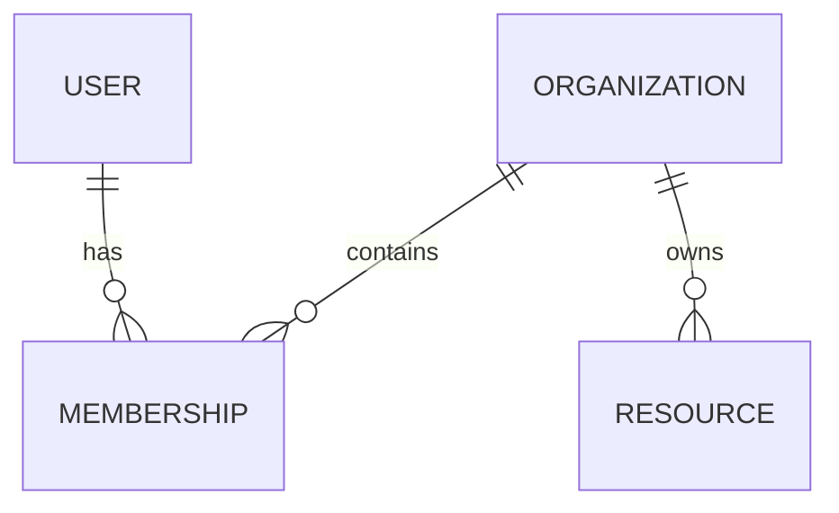

# Guide de développement d’un logiciel complet avec Codex

> **Statut : guide de référence optionnel.**  
> Ce fichier n’a pas vocation à être relu intégralement à chaque tâche. `AGENTS.md` reste la couche d’instructions permanente du projet. Pour une tâche donnée, Codex doit surtout inspecter les specs, le code, les tests et l’état Git directement concernés.

Ce guide décrit une méthode générique pour construire, maintenir et faire évoluer un logiciel complexe avec Codex.

Il est volontairement **agnostique** vis-à-vis :

- du langage ;
- du framework frontend ou backend ;
- du type d’application ;
- de la base de données ;
- de l’ORM ;
- du cloud ;
- du système de CI/CD ;
- de l’outil de déploiement.

Les chemins, exemples et commandes présentés ici doivent donc être adaptés au repository réel.

> **Principe central :** la conversation sert à travailler ; le repository sert à mémoriser, transmettre, vérifier et reprendre le travail.

## Lecture rapide

Le guide reste complet et textuel, mais les décisions les plus fréquentes disposent maintenant d’un **résumé visuel**. Le texte reste la référence normative ; les schémas servent à comprendre et retrouver rapidement la bonne règle.

| Besoin | Aller directement à |
| --- | --- |
| workflow issue → PR → merge, gates et niveau de preuve | [§7 — Workflow Git](#7-workflow-git-recommandé) |
| review d’un diff / PR | [§8 — Revue du diff](#8-revue-du-diff) |
| reprendre une tâche après perte de contexte | [§10 — Reprise](#10-reprendre-après-une-interruption-ou-une-perte-de-contexte) |
| choisir Chat, Work ou Codex | [§26 — Surface](#26-choisir-la-bonne-surface--chat-work-ou-codex) |
| choisir modèle / reasoning / orchestration | [§27 — Modèle et reasoning](#27-modèle-reasoning-et-orchestration) |
| choisir un routage coding / architecture / audit | [§28 — Routage pratique](#28-routage-pratique-pour-coding-architecture-et-audit) |

---

## 1. Principes directeurs

### 1.1 Le repository est la source de vérité

Pour un logiciel important, la connaissance durable ne doit pas vivre uniquement dans une conversation avec Codex. Elle doit être versionnée dans le repository.

Structure conceptuelle recommandée :

```text
AGENTS.md
README.md

specs/
  modules/
  architecture/
  security/
  data-model/
  decisions/
  prompts/

docs/

src/ ou équivalent
tests/
scripts/
```

Responsabilités :

| Élément | Rôle |
| --- | --- |
| `AGENTS.md` | Règles permanentes de travail pour les agents |
| `README.md` | Onboarding, installation et utilisation |
| `specs/modules/` | Comportement fonctionnel |
| `specs/architecture/` | Architecture structurante |
| `specs/security/` | Modèle et exigences de sécurité |
| `specs/data-model/` | Modèle de données indépendant de l’implémentation |
| `specs/decisions/` | Décisions d’architecture durables |
| `specs/prompts/` | Prompts réutilisables |
| `docs/` | Exploitation, procédures et documentation technique complémentaire |
| Code + migrations + tests | Implémentation réelle |

Les noms exacts peuvent être adaptés au projet.

### 1.2 Codex travaille mieux sur des tâches bornées

Éviter les demandes trop larges :

```text
Termine tout le module de facturation.
```

Préférer une demande structurée contenant :

1. l’objectif ;
2. le contexte ;
3. les contraintes ;
4. la Definition of Done.

Exemple :

```text
Lis AGENTS.md, les specs concernées et le code existant.

Objectif :
Ajouter la possibilité d’associer plusieurs devises à un compte.

Contraintes :
- conserver les invariants métier existants ;
- ne pas hard-coder les données métier ;
- respecter l’architecture existante ;
- éviter les refactors hors scope ;
- mettre à jour les specs concernées.

Done when :
- le modèle de données représente correctement le besoin ;
- les règles métier sont implémentées ;
- les interfaces concernées sont adaptées ;
- les tests pertinents passent ;
- les validations projet passent.
```

### 1.3 Les specs accompagnent le logiciel

Une fonctionnalité significative doit être décrite indépendamment de son implémentation.

Une bonne spec répond notamment à :

- pourquoi la fonctionnalité existe ;
- qui l’utilise ;
- quelles entités sont impliquées ;
- quelles règles métier s’appliquent ;
- quelles données doivent être persistées ;
- quels calculs ou états sont attendus ;
- quelles contraintes UX existent ;
- quels cas d’erreur doivent être gérés ;
- quels critères d’acceptation prouvent que le besoin est couvert.

Pour une correction locale déjà parfaitement spécifiée, une phase documentaire préalable n’est pas obligatoire.

### 1.4 La vérification fait partie de l’implémentation

Une tâche n’est pas terminée lorsque le code est simplement écrit.

Selon le projet, Codex doit exécuter ou vérifier :

- tests unitaires ;
- tests d’intégration ;
- tests end-to-end si pertinents ;
- compilation ou build ;
- lint ;
- validation des types ;
- migrations ;
- analyse statique ;
- contrôle du diff ;
- validation visuelle des changements UI ;
- vérifications de sécurité ;
- `git diff --check` ou équivalent.

Les commandes exactes doivent être définies dans `AGENTS.md`.

---

## 2. Les surfaces de configuration et de connaissance

### 2.1 `AGENTS.md`

`AGENTS.md` est la couche de règles durables du repository.

Il doit être :

- court ;
- normatif ;
- actionnable ;
- stable.

Y mettre notamment :

- commandes de build, lint et test ;
- conventions obligatoires ;
- architecture générale du repository ;
- règles de sécurité ;
- règles de documentation ;
- restrictions importantes ;
- comportement attendu avant de terminer une tâche.

Ne pas y mettre :

- specs métier détaillées ;
- longues explications d’architecture ;
- secrets ;
- journal de projet ;
- contexte temporaire d’une feature.

> Si Codex répète régulièrement la même erreur, transformer la correction en règle durable dans `AGENTS.md` ou dans un `AGENTS.md` local au sous-répertoire concerné.

#### Hiérarchie et portée des instructions

Utiliser `AGENTS.md` comme **contrat agent canonique** du repository.

Principes :

- un `AGENTS.md` racine porte les règles communes ;
- un `AGENTS.md` local peut spécialiser ou renforcer les règles pour un sous-arbre lorsque c’est réellement utile ;
- l’agent doit lire les instructions applicables au périmètre qu’il modifie avant d’écrire du code ;
- éviter des fichiers parallèles du type `CHATGPT.md`, `CODEX.md` ou autres contrats dupliqués s’ils peuvent diverger ;
- les règles durables vont dans `AGENTS.md`, les comportements produit dans les specs, et les décisions structurantes dans les ADR.

Le but est d’éviter plusieurs sources normatives contradictoires. Une règle récurrente doit avoir un emplacement canonique identifiable.

### 2.2 `specs/modules/`

Les specs fonctionnelles vivent dans `specs/modules/`.

```text
specs/
  modules/
    authentication.md
    users.md
    billing.md
    reporting.md
    imports.md
    notifications.md
```

Structure possible :

```markdown
# Module

## Objectif
## Acteurs
## Concepts métier
## Règles métier
## Données manipulées
## Parcours principaux
## Cas limites
## Permissions
## Critères d’acceptation
```

Ces fichiers décrivent **ce que fait le logiciel**, pas la manière dont un framework particulier l’implémente.

---

## 3. Les trois specs transverses minimales

En plus des specs fonctionnelles, un logiciel significatif devrait disposer de trois descriptions transverses : architecture, sécurité et modèle de données.

L’objectif n’est pas de produire une documentation lourde. Quelques pages bien maintenues valent mieux qu’une architecture de 100 pages jamais relue.

### 3.1 Spec d’architecture structurante

Fichier recommandé :

```text
specs/architecture/system-architecture.md
```

Cette spec décrit uniquement les choix structurants qui influencent plusieurs modules.

Elle peut contenir :

- objectifs architecturaux : maintenabilité, simplicité, scalabilité, résilience, portabilité, observabilité ;
- vue globale des composants ;
- responsabilités des couches ;
- frontières importantes ;
- flux structurants ;
- dépendances externes critiques ;
- contraintes techniques majeures ;
- références vers les ADR concernées.

Exemple conceptuel :

```text
Client
  ↓
API / application
  ↓
services métier
  ↓
persistence
  ↓
systèmes externes
```

Éviter d’en faire un catalogue de classes, de fichiers ou de composants techniques.

### 3.2 Spec de sécurité

Fichier recommandé :

```text
specs/security/security-model.md
```

Elle décrit le **modèle de sécurité du produit**, indépendamment d’un fournisseur d’identité ou d’un framework particulier.

Elle peut couvrir :

- types d’utilisateurs ;
- authentification ;
- gestion des sessions ;
- MFA si nécessaire ;
- récupération de compte ;
- rôles et permissions ;
- ownership ;
- séparation par organisation / tenant / workspace ;
- données sensibles ;
- contrôles serveur ;
- validation des entrées ;
- protection contre les accès horizontaux ;
- principe du moindre privilège ;
- auditabilité ;
- gestion des secrets ;
- risques principaux ;
- critères de validation sécurité.

Une feature qui modifie le modèle de confiance, les rôles ou l’isolation doit mettre à jour cette spec et, si nécessaire, produire une ADR.

### 3.3 Spec du modèle de données

Fichier recommandé :

```text
specs/data-model/domain-model.md
```

Cette spec est volontairement **indépendante de Prisma, Hibernate, Entity Framework, SQLAlchemy, Django ORM ou de tout autre outil**.

Pour chaque entité importante, documenter au minimum :

- responsabilité ;
- attributs métier principaux ;
- relations ;
- cardinalités ;
- contraintes ;
- règles d’unicité ;
- cycle de vie ;
- règles de suppression ;
- données sensibles éventuelles.

La spec peut contenir un diagramme Mermaid :


```mermaid
erDiagram
    USER ||--o{ MEMBERSHIP : has
    ORGANIZATION ||--o{ MEMBERSHIP : contains
    ORGANIZATION ||--o{ RESOURCE : owns
```

Éviter de figer inutilement :

- type SQL précis ;
- nom d’index spécifique ;
- syntaxe ORM ;
- annotation framework ;
- stratégie physique détaillée.

Relation recommandée :

```text
specs/data-model/domain-model.md
        ↓
modèle ORM / schéma SQL / documents / collections
        ↓
migrations
        ↓
base réelle
```

Le modèle ORM doit **implémenter** la spec de données, pas devenir l’unique documentation conceptuelle.

---

## 4. ADR : décisions structurantes

Les décisions qui ont un impact durable doivent être conservées dans :

```text
specs/decisions/
```

Exemple :

```text
001-use-relational-database.md
002-separate-domain-services.md
003-multi-tenant-isolation.md
```

Format simple :

```markdown
# ADR-003 — Isolation multi-tenant

## Contexte
## Décision
## Alternatives considérées
## Conséquences
## Date
```

Créer une ADR uniquement lorsqu’une décision mérite réellement d’être conservée. Ne pas transformer chaque choix de code en ADR.

---

## 5. README

Le `README.md` s’adresse principalement à un humain qui découvre ou exécute le projet.

Il doit généralement contenir :

- objectif du projet ;
- prérequis ;
- installation ;
- configuration ;
- démarrage ;
- tests ;
- structure générale ;
- variables d’environnement ;
- liens vers les specs.

Éviter d’y déplacer toute la documentation métier ou architecture.

---

## 6. Relation entre les fichiers

### 6.1 Changement fonctionnel

```text
spec module
    ↓
modèle de données si nécessaire
    ↓
implémentation
    ↓
tests
    ↓
README si impact utilisateur
```

Créer ou modifier une ADR uniquement si une décision structurante apparaît.

### 6.2 Changement de données

Lorsqu’une donnée persistante change :

1. mettre à jour la spec fonctionnelle si nécessaire ;
2. mettre à jour `specs/data-model/domain-model.md` si le modèle conceptuel change ;
3. modifier le modèle ORM ou le schéma physique ;
4. créer la migration si nécessaire ;
5. adapter les services métier ;
6. adapter les imports / exports ;
7. vérifier les tests et migrations.

### 6.3 Changement d’architecture

Lorsqu’une décision touche plusieurs modules :

1. mettre à jour la spec d’architecture ;
2. créer une ADR si la décision mérite d’être conservée ;
3. identifier les modules impactés ;
4. implémenter par incréments ;
5. vérifier l’absence de dérive architecture / code.

### 6.4 Changement de sécurité

Lorsqu’une évolution touche l’authentification, l’autorisation, les rôles, les données sensibles, l’isolation, les imports / exports, l’audit ou les secrets :

1. mettre à jour la spec sécurité ;
2. mettre à jour la spec fonctionnelle concernée ;
3. créer une ADR si le modèle de confiance change ;
4. ajouter ou adapter les tests sécurité ;
5. revoir les logs, erreurs et données temporaires.

---

## 7. Workflow Git recommandé

Principe :

> **Une issue auto-porteuse = une intention principale = une branche de travail.**

Pour toute tâche significative, l’issue GitHub est la source de vérité du **WHY / WHAT / contraintes / résultat attendu**. Elle doit être compréhensible et exécutable par un humain ou un LLM qui n’a pas accès à la conversation d’origine.

Utiliser **une issue par tâche distincte**. Avant d’en créer une nouvelle, rechercher une issue équivalente et l’enrichir plutôt que créer un doublon.

Règles de branche :

- ne pas développer directement sur `main` ;
- partir d’un `main` à jour ou d’une base explicitement choisie ;
- une branche doit porter une intention principale ;
- séparer les changements indépendants dans des PR différentes ;
- garder `main` dans un état intégrable et vérifiable ;
- lorsque la plateforme le permet, protéger `main` avec PR obligatoire et status checks requis plutôt que dépendre uniquement de conventions humaines ;
- lorsque plusieurs agents travaillent en parallèle, isoler les workstreams indépendants dans des branches ou worktrees séparés et éviter les écritures concurrentes sur les mêmes fichiers sans coordination explicite.

### Vue d’ensemble


Le visuel résume le flux et les principaux gates. Les étapes détaillées ci-dessous restent la règle d’exécution, notamment pour les dépendances, branches obsolètes, migrations et validations spécifiques.

Étapes :

1. créer ou enrichir l’issue avec le contexte complet, le périmètre, les critères d’acceptation, les dépendances et la Definition of Done ;
2. renseigner lorsque le projet les utilise : `Phase`, `Priority`, `Execution Order`, `Agent Ready` et `Depends on` ;
3. vérifier les dépendances, l’ordre d’exécution et la readiness ;
4. créer une branche courte liée à l’intention de l’issue ;
5. lire les instructions, specs et fichiers concernés ;
6. préparer un plan avant modification lorsque la tâche est complexe ou risquée ;
7. mettre à jour les specs nécessaires ;
8. implémenter la tranche minimale ;
9. exécuter les validations ;
10. revoir le diff ;
11. créer ou mettre à jour la PR en la liant à l’issue ;
12. faire reviewer puis merger ;
13. fermer l’issue uniquement lorsque les critères d’acceptation et la Definition of Done sont satisfaits.

La PR documente le **HOW** : changements réalisés, approche d’implémentation, impacts architecture / sécurité / données lorsqu’ils existent, tests, documentation et limites connues.

`Execution Order` et `Depends on` sont différents : le premier sert à séquencer le travail prêt à être exécuté ; le second exprime de vraies dépendances qui doivent être satisfaites au préalable.

Le Project GitHub, lorsqu’il est utilisé, sert principalement à l’organisation, la priorité, l’ordre d’exécution, la readiness et le statut. Le contexte nécessaire à l’exécution doit rester dans l’issue et le repository.

Lorsque les champs `Execution Order`, `Agent Ready` et `Depends on` sont utilisés, une règle de prise de travail simple est :

1. considérer uniquement les issues ouvertes avec `Agent Ready = Yes` ;
2. exclure celles dont les dépendances ne sont pas satisfaites ;
3. parmi les tâches restantes, privilégier le plus petit `Execution Order` ;
4. ne pas interpréter `Execution Order` comme une dépendance implicite.

`Agent Ready` signifie que l’issue contient suffisamment de contexte, de contraintes et de critères d’acceptation pour être exécutée sans reconstruire le besoin depuis un chat.

### 7.1 Gates avant merge

Une PR n’est pas mergeable uniquement parce que le code “semble bon”.

Avant merge, vérifier selon le projet :

- PR sortie du mode draft ;
- branche suffisamment à jour par rapport à la cible ;
- build / compilation ;
- lint / format / type checking ;
- tests unitaires ;
- tests d’intégration ;
- tests end-to-end ou smoke tests lorsque le changement traverse plusieurs composants ;
- migrations et compatibilité de données ;
- analyses statiques ;
- contrôles de sécurité et secrets ;
- revue du diff ;
- documentation et specs impactées ;
- critères d’acceptation et Definition of Done.

**Un finding sécurité non résolu ou une validation obligatoire en échec bloque le merge.**

Pour un changement transverse, un test unitaire vert n’est pas une preuve suffisante : il faut valider le flux intégré pertinent.

### 7.2 Branches obsolètes, PR empilées et squash merges

Ne pas décider qu’une branche doit être mergée simplement parce qu’elle est “ahead” ou contient des commits absents de `main`.

Un squash merge réécrit l’historique : une ancienne branche peut sembler contenir des commits supplémentaires alors que son **contenu fonctionnel** est déjà intégré.

Avant de merger une branche ancienne ou empilée :

1. comparer le contenu réel avec `main` ;
2. vérifier les PR déjà mergées dont elle dépend ;
3. identifier ce qui est réellement absent de `main` ;
4. rebaser ou mettre à jour la branche si nécessaire ;
5. rejouer les validations après toute mise à jour significative ;
6. fermer les PR devenues redondantes ou remplacées au lieu de merger du bruit historique.

La topologie Git est un signal ; **le diff réel et les validations sont la preuve**.

### 7.3 Dépendances et migrations majeures

Les mises à jour majeures de framework, provider, runtime, ORM ou dépendances critiques demandent un traitement explicite.

Ne pas auto-merger une upgrade majeure uniquement parce que les checks superficiels passent. Vérifier notamment :

- breaking changes ;
- compatibilité avec le code et l’infrastructure ;
- lockfiles ;
- migrations ;
- changements de comportement par défaut ;
- tests réellement représentatifs ;
- impact sur les autres stacks ou composants.

Lorsqu’une migration touche plusieurs éléments qui doivent évoluer ensemble, préférer une **PR coordonnée dédiée** plutôt qu’une série de merges partiels qui laissent temporairement `main` incohérent.

---

## 8. Revue du diff

Prompt générique :

```text
Review les changements non committés comme une Pull Request.

Priorise :
- bugs ;
- régressions ;
- incohérences specs / code ;
- problèmes de modèle de données ;
- risques sécurité ;
- tests manquants ;
- changements hors scope.

Ne propose pas de refactor cosmétique non demandé.
```

Pour une évolution importante ou risquée, effectuer si possible une **seconde revue en contexte frais** : un reviewer ou agent qui n’a pas participé à l’implémentation détecte mieux les hypothèses implicites, oublis et rationalisations du premier passage.

Ordre de priorité d’une revue :

1. correctness / bugs / régressions ;
2. sécurité et isolation ;
3. cohérence avec les specs, ADR et invariants ;
4. modèle de données et migrations ;
5. couverture de tests et qualité des preuves ;
6. opérabilité / rollback / observabilité ;
7. maintenabilité ;
8. style et cosmétique en dernier.

Une revue doit chercher ce qui peut réellement casser ou invalider le besoin, pas maximiser le nombre de commentaires.

L’agent peut proposer, implémenter et reviewer, mais la responsabilité des décisions structurantes, destructives, de sécurité ou de production reste humaine. L’autonomie d’exécution ne doit pas devenir une délégation aveugle de responsabilité.

---

## 9. Issues auto-porteuses : contexte durable d’une tâche

Le contexte conversationnel est temporaire. Pour toute tâche significative, maintenir le contexte durable dans une **issue GitHub auto-porteuse**.

Une issue doit permettre à un nouvel agent de comprendre et poursuivre le travail sans relire les conversations précédentes. Utiliser une issue par tâche distincte et enrichir une issue équivalente existante plutôt que la dupliquer.

Structure recommandée :

```markdown
## Objectif
## Contexte / problème
## Comportement / résultat attendu
## Périmètre
## Hors périmètre
## Critères d’acceptation
## Contraintes
## Dépendances / Depends on
## Phase / Priority / Execution Order / Agent Ready si utilisés
## Fichiers / specs / références utiles
## Validation / tests
## Definition of Done
```

L’issue décrit principalement **WHY / WHAT / contraintes / résultat**. Le contributeur choisit le **HOW**, sauf lorsqu’une contrainte technique ou architecturale est intentionnellement imposée.

Les décisions nécessaires à une future reprise ne doivent pas rester uniquement dans le chat. Selon leur nature, les conserver dans :

- l’issue ;
- la PR ;
- les specs ;
- une ADR ;
- la documentation du repository.

### Deprecated : Long-Running Tasks / `TASK_STATE.md`

L’ancien workflow consistant à maintenir `TASK_STATE.md` pour les tâches longues ou interrompables est **déprécié**.

Ne pas créer ou maintenir `TASK_STATE.md` comme mécanisme standard de continuité. Le contenu utile d’un ancien fichier de task state peut être migré dans l’issue correspondante.

N’utiliser un fichier de task state que si un repository ou un workflow particulier l’exige explicitement.

---

## 10. Reprendre après une interruption ou une perte de contexte

Prompt recommandé :

```text
Continue le travail de cette issue GitHub.

Avant de poursuivre, reconstruis précisément l’état réel du travail à partir de :

1. l’issue et ses commentaires pertinents ;
2. les Pull Requests liées et leurs reviews ;
3. git status ;
4. git diff ;
5. les fichiers, specs, tests et l’historique Git pertinents.

Identifie ce qui est déjà terminé et ce qui reste à faire.
Ne refais pas les tâches terminées.

Si l’issue n’est plus suffisamment auto-porteuse pour permettre une reprise sûre, mets d’abord son contexte à jour.

Puis continue jusqu’aux validations, à la PR/review, au merge et à la fermeture de l’issue lorsque la Definition of Done est satisfaite.
```

La reprise s’appuie en priorité sur l’issue et l’état réel du repository, pas sur la mémoire de la conversation.

---

## 11. Changer de thread sans perdre le contexte utile

Garder le même thread lorsque :

- la tâche reste identique ;
- le contexte récent facilite encore l’exécution ;
- Codex doit corriger sa propre implémentation ;
- le nombre de fichiers reste raisonnable.

Créer un nouveau thread lorsque :

- on change de feature ou d’issue ;
- le contexte contient trop d’explorations abandonnées ;
- des contraintes anciennes polluent la tâche ;
- une revue indépendante est souhaitée ;
- la feature précédente est terminée.

Dans un nouveau thread, utiliser l’issue GitHub comme point d’entrée. Relire au minimum `AGENTS.md`, l’issue, les specs concernées, les PR liées et le diff courant si nécessaire.

Le thread est un espace de travail temporaire ; l’issue et le repository portent le contexte durable.

---

## 12. Handoff

Un handoff n’a pas besoin d’un fichier séparé lorsque l’issue et la PR sont à jour.

Avant de quitter une session importante, vérifier que le contexte durable permet une reprise sans le chat :

- l’objectif et le périmètre restent clairs dans l’issue ;
- les décisions importantes sont documentées ;
- l’état d’avancement est visible dans l’issue ou la PR ;
- les fichiers et specs importants sont référencés si nécessaire ;
- les validations réalisées et restantes sont identifiables ;
- les risques ou blocages sont visibles ;
- la prochaine action peut être déduite sans ambiguïté.

Mettre à jour l’issue, la PR ou la documentation durable concernée plutôt que créer un handoff conversationnel isolé.

---

## 13. Prompts réutilisables

### 13.1 Cadrer une feature

```text
Lis AGENTS.md, README.md et les specs existantes.

Je veux ajouter :
[description]

Avant l’implémentation :
- identifie les specs concernées ;
- clarifie les règles métier ;
- identifie les impacts architecture, données et sécurité ;
- propose les critères d’acceptation ;
- liste les fichiers probablement concernés.

Ne crée pas de complexité inutile.
```

### 13.2 Implémenter depuis une spec

```text
Lis AGENTS.md et les specs concernées.

Implémente uniquement ce qui est décrit.

Contraintes :
- respecter l’architecture existante ;
- ne pas hard-coder les données métier ;
- ne pas introduire de dépendance inutile ;
- ne pas refactorer hors scope ;
- préserver les comportements existants non concernés.

Mets à jour les specs et README si nécessaire.
Termine par les validations définies dans AGENTS.md.
```

### 13.3 Debugger

```text
Bug :
[description]

Reproduction :
[étapes]

Attendu :
[...]

Observé :
[...]

Identifie la cause racine avant de modifier le code.
Implémente ensuite le correctif minimal.
Si le bug révèle une ambiguïté de spec, mets la documentation correspondante à jour.
Exécute les validations pertinentes.
```

### 13.4 Refactoriser

```text
Je veux refactoriser [zone] pour [objectif].

Contraintes :
- comportement fonctionnel inchangé ;
- modèle de données inchangé sauf demande explicite ;
- pas de changement UX ;
- changements faciles à reviewer ;
- validations avant et après.

Commence par cartographier les dépendances et les risques.
```

### 13.5 Revue architecture

```text
Review l’architecture de cette implémentation.

Compare-la avec :
- specs/architecture/ ;
- specs/data-model/ ;
- les ADR pertinentes.

Vérifie notamment :
- séparation des responsabilités ;
- dépendances incorrectes ;
- duplication de logique métier ;
- couplage excessif ;
- dépendances circulaires ;
- cohérence avec le modèle de données ;
- maintenabilité.

Priorise les risques réels.
```

### 13.6 Revue sécurité

```text
Fais une revue sécurité de cette feature.

Compare avec specs/security/.

Cherche en priorité :
- contrôle d’accès manquant ;
- validation uniquement côté client ;
- accès horizontal possible ;
- exposition de données sensibles ;
- secrets ;
- logs trop bavards ;
- erreurs révélant des informations internes ;
- imports non validés ;
- exports trop permissifs ;
- incohérences entre spec et implémentation.

Classe les findings par sévérité.
```

### 13.7 Revue du modèle de données

```text
Review le changement de modèle de données.

Compare :
- la spec fonctionnelle ;
- specs/data-model/domain-model.md ;
- le modèle ORM ou schéma physique ;
- les migrations.

Vérifie :
- cardinalités ;
- contraintes ;
- unicité ;
- nullable / obligatoire ;
- ownership ;
- cycle de vie ;
- suppression ;
- compatibilité avec les données existantes.

Ne propose pas d’optimisation physique sans besoin démontré.
```

---

## 14. Plan avant tâche complexe

Pour une migration, une refonte importante, un changement transverse ou un changement à risque, demander un plan avant l’implémentation.

Le plan doit être **reviewé avant de commencer à modifier le code** lorsque des erreurs de cadrage seraient coûteuses. L’objectif est de résoudre d’abord les ambiguïtés d’intention, d’architecture, de données et de sécurité.

Pour une tâche locale, bornée et peu risquée, ne pas imposer une cérémonie inutile : un cycle `explore → implement → verify` peut être suffisant.

Le plan doit préciser :

- le besoin ;
- les specs impactées ;
- les impacts architecture, sécurité et données ;
- les fichiers probablement concernés ;
- 5 à 8 étapes d’exécution ;
- les principaux risques ;
- les validations finales.

Pour une correction locale simple, un plan formel est inutile.

Après validation du plan :

- travailler par petits incréments autonomes ;
- vérifier chaque incrément avant d’élargir le scope ;
- ne pas mélanger un refactor opportuniste non nécessaire à la tâche ;
- réévaluer le plan si le repository réel contredit les hypothèses initiales.

---

## 15. Développement incrémental

Éviter de modifier simultanément de grandes parties indépendantes du système.

Préférer :

```text
spec
  ↓
modèle
  ↓
backend / domaine
  ↓
interface
  ↓
tests
  ↓
review
```

Chaque incrément doit être suffisamment petit pour être compris et revu.

---

## 16. Sécurité des secrets

Ne jamais versionner :

- clés API ;
- mots de passe ;
- tokens ;
- certificats privés ;
- credentials cloud ;
- données personnelles réelles inutiles ;
- exports clients sensibles.

Utiliser selon l’environnement :

- variables d’environnement ;
- secret manager ;
- vault ;
- credentials temporaires.

Le repository peut contenir les **noms** des variables requises, mais pas leurs valeurs réelles.

---

## 17. Données de démonstration et données réelles

Séparer clairement :

```text
données de démonstration
≠ données de développement
≠ données de test
≠ données de production
```

Éviter que :

- les seeds deviennent une source de vérité métier ;
- les tests dépendent de données réelles ;
- des exports de production soient committés ;
- les exemples contiennent des données personnelles.

---

## 18. Architecture : principes génériques

Chercher à conserver des frontières claires entre :

```text
présentation
application / orchestration
domaine métier
persistence
intégrations externes
infrastructure
```

Ce découpage n’implique pas nécessairement six dossiers différents. Le principe important est que les responsabilités restent compréhensibles et testables.

Exemple de flux :

```text
UI / API
   ↓
use case / application service
   ↓
domain logic
   ↓
repository / persistence
```

Pour une architecture simple, plusieurs couches peuvent être fusionnées. Ne pas introduire de complexité architecturale sans justification.

---

## 19. Modèle de données : conceptuel vs implémentation

Le modèle conceptuel décrit le métier. L’ORM ou le schéma physique décrit son implémentation.

```text
specs/data-model/domain-model.md
        ↓
Prisma / Hibernate / Entity Framework
SQLAlchemy / Django ORM / Drizzle / TypeORM
SQL natif / MongoDB schema / autre
```

La spec ne doit pas contenir d’hypothèse inutile propre à l’outil choisi. Lorsqu’un ORM change, le modèle métier doit rester compréhensible.

---

## 20. Déploiement

Le déploiement doit être traité comme une opération contrôlée.

Avant une mise en production, vérifier au minimum :

- environnement cible ;
- configuration ;
- secrets ;
- migrations ;
- compatibilité des données ;
- stratégie de rollback ;
- build ;
- tests ;
- observabilité ;
- health checks ;
- sauvegarde si nécessaire ;
- changements de sécurité ;
- changements d’infrastructure ;
- impacts utilisateurs.

Ne lancer aucune action destructive sans validation explicite.

### 20.1 Niveaux de preuve

Le niveau de preuve est également représenté dans le [schéma workflow / merge gates](docs/images/08-git-workflow-gates-evidence.svg).

Ne pas confondre les niveaux suivants :

1. **revue statique** : lecture du code / configuration ;
2. **validation locale** : lint, build, tests, analyse statique ;
3. **plan ou dry-run** : ce que l’outil prévoit de faire ;
4. **intégration** : plusieurs composants testés ensemble ;
5. **déploiement réel** : changement appliqué dans un environnement ;
6. **preuve opérationnelle** : comportement observé, métriques, logs, health checks, données de sortie ou artefacts de validation.

Une CI verte ne prouve pas qu’un système a été déployé avec succès. Un `terraform validate` ne prouve pas qu’un `plan/apply` réel fonctionne. Un mock vert ne prouve pas une intégration externe.

Les affirmations du projet doivent toujours correspondre au niveau de preuve réellement obtenu.

Pour une release significative, conserver selon le contexte :

- notes de release ;
- tag/version depuis un `main` validé ;
- point ou stratégie de rollback ;
- fenêtre de déploiement ;
- impacts et points d’attention ;
- preuves de validation suffisamment sanitizées pour être conservées.

---

## 21. Definition of Done standard

Pour une feature significative, le travail est terminé lorsque :

- la spec fonctionnelle est à jour ;
- la spec architecture est à jour si un choix structurant change ;
- la spec sécurité est à jour si le modèle de sécurité change ;
- la spec data-model est à jour si le modèle conceptuel change ;
- les ADR nécessaires existent ;
- l’implémentation correspond aux specs ;
- aucun comportement non demandé n’a été ajouté ;
- les tests pertinents passent ;
- le build passe ;
- le lint passe ;
- les migrations sont validées si elles changent ;
- les parcours UI importants sont vérifiés si nécessaire ;
- le diff a été relu ;
- aucun secret ou fichier indésirable n’est introduit ;
- les risques ou validations non effectuées sont explicitement signalés.

---

## 22. Anti-patterns

Éviter :

- mettre toute la connaissance dans les conversations ;
- utiliser la mémoire de Codex comme source de vérité ;
- écrire des specs dépendantes d’un framework sans nécessité ;
- utiliser le schéma ORM comme seule documentation métier ;
- mettre toute l’architecture dans `README.md` ;
- transformer `AGENTS.md` en documentation exhaustive ;
- demander plusieurs features indépendantes dans un même prompt ;
- lancer un refactor non lié pendant une feature ;
- coder une règle métier ambiguë sans clarification ;
- faire travailler deux agents sur les mêmes fichiers sans coordination ;
- hard-coder des données métier ;
- committer des secrets ;
- ignorer les migrations ;
- ignorer les tests ;
- accepter un diff sans revue ;
- travailler directement sur `main` pour une tâche significative ;
- merger une PR draft ;
- merger avec des checks obligatoires rouges ou une alerte sécurité non résolue ;
- conclure qu’une branche doit être mergée uniquement à partir de `ahead_by` ou de sa liste de commits ;
- confondre validation statique et preuve de déploiement réel ;
- faire travailler plusieurs agents sur les mêmes fichiers sans coordination ;
- créer des abstractions prématurées ;
- sur-architecturer un besoin simple ;
- conserver un thread devenu confus alors que le repository permet de repartir proprement.

---

## 23. Structure de référence recommandée

```text
AGENTS.md
README.md

specs/
  README.md

  modules/
    module-a.md
    module-b.md

  architecture/
    system-architecture.md

  security/
    security-model.md

  data-model/
    domain-model.md

  decisions/
    001-example.md

  prompts/
    feature.md
    review.md

docs/
  runbook.md

src/
tests/
scripts/
```

Cette structure est une **référence**, pas une obligation.

Pour un petit projet :

```text
specs/
  product.md
  architecture.md
  security.md
  data-model.md
```

L’objectif est la clarté, pas le nombre de fichiers.

---

## 24. Cadence recommandée pour un produit long

Cycle conseillé :

1. besoin ;
2. issue GitHub auto-porteuse ;
3. spec fonctionnelle si nécessaire ;
4. vérification architecture / sécurité / données ;
5. plan si nécessaire ;
6. implémentation incrémentale ;
7. tests ;
8. revue ;
9. documentation ;
10. PR liée à l’issue ;
11. merge ;
12. fermeture de l’issue ;
13. retour d’expérience.

Après chaque friction récurrente, demander :

> Est-ce qu’une nouvelle règle doit être ajoutée dans `AGENTS.md`, une spec, une ADR ou un prompt réutilisable ?

Le repository devient ainsi progressivement meilleur pour les humains comme pour les agents.

---

## 25. Règle de décision : où documenter quoi ?

| Information | Emplacement |
| --- | --- |
| Règle permanente pour Codex | `AGENTS.md` |
| Fonctionnalité métier | `specs/modules/` |
| Architecture structurante | `specs/architecture/` |
| Sécurité | `specs/security/` |
| Modèle conceptuel / logique de données | `specs/data-model/` |
| Décision durable | `specs/decisions/` |
| Installation / utilisation | `README.md` |
| Exploitation | `docs/` |
| Prompt répétable | `specs/prompts/` |
| Contexte durable d’une tâche | Issue GitHub auto-porteuse + PR liée |
| Implémentation réelle | code + migrations + tests |

---

## 26. Choisir la bonne surface : Chat, Work ou Codex

Avant de choisir un modèle ou un niveau de reasoning, choisir **l’environnement adapté au travail**.


Le visuel donne la décision rapide ; le tableau suivant conserve les critères textuels et reste plus facile à rechercher dans le repository.

| Surface | Utiliser pour | Éviter comme choix naturel pour |
| --- | --- | --- |
| **Chat** | questions rapides, brainstorming, explications, recherche ponctuelle, préparation de décisions et de prompts | modifier durablement un repository ou conduire un workflow technique long |
| **Work** | recherche longue, analyse multi-documents, dossiers, audits documentaires, rapports, présentations, feuilles de calcul et livrables multi-étapes | développement repo-centric nécessitant branches, commandes, tests et PR |
| **Codex** | écrire ou debugger du code, explorer un repository, exécuter des commandes/tests, patcher, reviewer, refactorer et préparer des PR | tâches purement conversationnelles sans besoin du repository |

Règle pratique :

> **Dès que le repository, les tests, les commandes ou la PR sont au centre du problème, Codex devient l’environnement par défaut.**

Chat peut servir à cadrer ou challenger une décision. Work est préférable lorsque le cœur de la tâche est un ensemble de sources et un livrable final. Codex est préférable lorsque le cœur de la tâche est l’état réel du logiciel.

---

## 27. Modèle, reasoning et orchestration

> **Snapshot OpenAI : octobre 2026.** Les noms de modèles, prix, disponibilités et options produit peuvent évoluer. Vérifier les sources officielles avant d’en faire une contrainte durable.


Le choix correct se fait sur **quatre dimensions distinctes** :

1. **modèle** : capacité de base ;
2. **reasoning effort** : quantité de raisonnement allouée ;
3. **surface** : Chat, Work ou Codex ;
4. **orchestration** : un agent ou plusieurs agents.

Ne pas mélanger ces concepts. Changer de modèle, augmenter le reasoning et ajouter des agents résolvent des problèmes différents.

### 27.1 Hiérarchie pratique des modèles


Le schéma fournit le routage rapide. Le tableau garde le positionnement sous une forme textuelle, diffable et recherchable.

| Modèle | Positionnement | Usage pratique |
| --- | --- | --- |
| **GPT-6 Luna** | le plus efficient | extraction, classification, transformations simples, tâches focalisées et volume élevé |
| **GPT-6.1 Sol** | équilibre intelligence / coût | workhorse pour coding complexe, computer use et travail professionnel |
| **GPT-6 Astra** | capacité maximale | problèmes les plus exigeants, architecture critique, recherche difficile, coding et computer use à enjeux élevés |
| **GPT-6 Sol** | génération précédente | surtout continuité de benchmark, compatibilité ou migration contrôlée |

Au 4 octobre 2026, les tarifs API standard publiés pour les modèles principaux sont :

| Modèle | Input / 1M tokens | Output / 1M tokens |
| --- | ---: | ---: |
| GPT-6 Luna | $0.10 | $0.50 |
| GPT-6.1 Sol | $2 | $10 |
| GPT-6 Astra | $10 | $50 |

Ces prix sont **informatifs et datés**. Ne pas les dupliquer dans des règles permanentes sans date ni source.

### 27.2 Niveaux de reasoning


Dans l’API, les niveaux disponibles dépendent du modèle et peuvent inclure :

```text
none / minimal / low / medium / high / xhigh / max
```

Pour GPT-6.1 Sol et GPT-6 Astra, la lecture pratique est :

- **Low** : tâche claire, peu ambiguë, priorité à la vitesse ;
- **Medium** : travail professionnel standard ;
- **High** : architecture, coding sérieux, analyse complexe ;
- **XHigh** : audit, sécurité, investigation ou recherche plus profonde ;
- **Max** : problème difficile, coût d’omission élevé, priorité à la qualité.

Augmenter l’effort uniquement quand le problème le justifie. Plus haut peut améliorer la qualité, mais augmente généralement usage et latence.

Ne pas supposer qu’un modèle plus faible poussé au maximum est toujours meilleur qu’un modèle plus capable avec un effort plus bas. Comparer sur des cas représentatifs et garder **le réglage le plus léger qui satisfait le niveau de qualité requis**.

> Note API : `reasoning.mode` (`standard` / `pro` lorsqu’il est supporté) et `reasoning.effort` sont deux réglages distincts.

### 27.3 Max vs Ultra


**Max** est un niveau de reasoning API / modèle lorsqu’il est supporté.

**Ultra** est un choix produit de Work/Codex : il ne constitue pas un modèle distinct ni un niveau API supérieur à `max`. La documentation OpenAI indique qu’Ultra utilise le raisonnement maximal et peut lancer des agents supplémentaires pour les utilisateurs éligibles.

Lecture pratique :

- **Max** : profondeur maximale pour un problème cohérent traité par un agent principal ;
- **Ultra** : max + possibilité de délégation lorsque plusieurs workstreams indépendants bénéficient réellement d’une exploration parallèle.

### 27.4 Single-agent vs multi-agent

Utiliser plusieurs agents lorsque la tâche se décompose en sous-problèmes **indépendants et bornés**, par exemple :

- explorer des zones différentes d’un gros repository ;
- comparer plusieurs hypothèses ou documents ;
- investiguer plusieurs causes possibles d’un bug ;
- réaliser une revue architecture, sécurité et tests en parallèle ;
- implémenter des composants indépendants ou des suites de tests distinctes.

Préférer **un seul agent** lorsque :

- chaque étape dépend fortement de la précédente ;
- la tâche est courte ;
- plusieurs agents modifieraient le même état mutable ou les mêmes fichiers ;
- un ordre déterministe est important ;
- le coût de coordination dépasse le gain de parallélisme.

Le multi-agent améliore surtout la **couverture et le parallélisme** ; il n’est pas une garantie automatique de meilleure qualité.

---

## 28. Routage pratique pour coding, architecture et audit

La règle générale est :

> **Commencer avec le plus petit niveau qui satisfait le besoin, puis escalader quand la complexité, l’ambiguïté ou le coût d’une omission le justifient.**

### 28.1 Coding


Le tableau ci-dessous reste utile comme version compacte et facilement diffable.

| Besoin | Surface | Modèle | Reasoning |
| --- | --- | --- | --- |
| Fonction / script simple | Codex | GPT-6.1 Sol | Medium |
| Développement normal / feature | Codex | GPT-6.1 Sol | High |
| Refactoring complexe / plusieurs fichiers | Codex | GPT-6.1 Sol | High → Max |
| Debug difficile / bug non local | Codex | GPT-6.1 Sol | Max |
| Architecture logicielle / sécurité critique | Codex | GPT-6 Astra | High → Max |
| Gros repository + workstreams indépendants | Codex | GPT-6.1 Sol ou Astra | Ultra si le parallélisme apporte un gain réel |

Raccourci recommandé pour un travail technique sérieux :

```text
GPT-6.1 Sol High
      ↓ si nécessaire
GPT-6.1 Sol Max
      ↓ si enjeux / ambiguïté / criticité augmentent
GPT-6 Astra High / Max
      ↓ si plusieurs workstreams indépendants le justifient
Ultra
```

### 28.2 Architecture Data/AI, Cloud et audit


| Besoin | Routage pratique |
| --- | --- |
| Architecture Data/AI / Cloud standard | GPT-6.1 Sol High |
| Trade-off stratégique ambigu / décision structurante | GPT-6 Astra High |
| Audit code + docs, première passe détaillée | GPT-6.1 Sol Max |
| Audit transverse / dernière passe / recherche d’omissions | GPT-6 Astra + Ultra si le travail est réellement parallélisable |
| Extraction / inventaire massif à faible complexité par item | GPT-6 Luna |

Pour un audit exigeant, une stratégie efficace peut être :

1. **passe locale exhaustive** avec GPT-6.1 Sol Max ;
2. **passe de challenge** avec Astra High sur les décisions et contradictions ;
3. **passe transverse indépendante** avec Astra/Ultra lorsque plusieurs axes peuvent être examinés en parallèle.

L’objectif n’est pas de multiplier les passes mécaniquement, mais de réduire les angles morts quand le coût d’une omission est élevé.

### 28.3 Évaluation plutôt qu’intuition

Pour un workflow récurrent :

1. conserver quelques cas représentatifs ;
2. comparer plusieurs modèles / efforts sur les mêmes entrées ;
3. mesurer qualité, omissions, temps et coût ;
4. choisir le niveau le plus léger qui passe le seuil attendu ;
5. réévaluer lors d’un changement majeur de modèle ou de workflow.

Les préférences de routage sont des **defaults**, pas des vérités absolues.

### 28.4 Sources OpenAI — snapshot octobre 2026

- Models: https://developers.openai.com/api/docs/models
- GPT-6.1 Sol: https://developers.openai.com/api/docs/models/gpt-6.1-sol
- GPT-6 Astra: https://developers.openai.com/api/docs/models/gpt-6-astra
- Reasoning: https://developers.openai.com/api/docs/guides/reasoning
- Multi-agent: https://developers.openai.com/api/docs/guides/responses-multi-agent
- ChatGPT Work & Codex: https://help.openai.com/en/articles/20001275-chatgpt-work-and-codex
- ChatGPT rate card: https://help.openai.com/en/articles/11481834-chatgpt-rate-card-business-enterpriseedu-credit-based-pricing

---

## 29. Principe final

Codex ne doit pas être utilisé comme une mémoire magique capable de reconstruire indéfiniment un logiciel depuis une conversation.

Le système fiable est :

```text
Intentions humaines
      ↓
Specs
      ↓
Architecture / Security / Data Model
      ↓
Code
      ↓
Tests
      ↓
Git
      ↓
Review
```

Codex intervient dans chacune de ces étapes, mais la source de vérité reste le repository.

La meilleure utilisation de Codex sur un logiciel long consiste donc à construire progressivement un projet où :

- les règles sont explicites ;
- les décisions importantes sont versionnées ;
- les specs restent proches du code ;
- le modèle métier n’est pas lié à un framework ;
- les changements sont petits et vérifiables ;
- Git protège l’historique ;
- les tests prouvent les comportements ;
- une nouvelle conversation peut reprendre le travail en relisant le repository.
